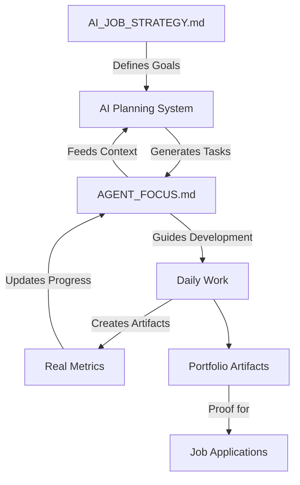

# 🤖 AI-Integrated Development Workflow

## How AI, AGENT_FOCUS.md, and AI_JOB_STRATEGY.md Work Together

### 🎯 The Complete Loop



### 📋 AGENT_FOCUS.md - The Living Document

Each agent has ONE planning document that AI updates:

```markdown
# AGENT_FOCUS.md Structure
- Identity & Mission (from AI_JOB_STRATEGY.md)
- Service Ownership (what to work on)
- Current Sprint (AI-generated tasks)
- Portfolio Checklist (tracks real files)
- Progress Metrics (from real data)
- Notes & Learnings (agent adds)
```

### 🤖 AI Commands for Task Management

```bash
# Morning: AI plans your day
just ai-morning         # Runs full routine including focus update

# During work: Track progress
just focus-plan         # AI generates new tasks
just focus-update       # Update metrics from real data
just focus-complete "task name"  # Mark task done
just focus-status       # See current progress

# Weekly: Sync with job strategy
just focus-sync         # Align with AI_JOB_STRATEGY.md
```

### 📊 How AI Plans Tasks

1. **Reads Context**:
   - Current AGENT_FOCUS.md (what's done, what's pending)
   - AI_JOB_STRATEGY.md (job requirements, priorities)
   - Real metrics (MLflow models, costs, etc.)

2. **Generates Tasks Based on Agent**:
   - **A1**: MLflow tasks, SLO gates, monitoring
   - **A2**: vLLM deployment, cost optimization, RAG
   - **A3**: Achievement collection, documentation
   - **A4**: A/B testing, revenue tracking, FinOps

3. **Prioritizes by Portfolio Gaps**:
   - Checks which artifacts are missing
   - Focuses on job application needs
   - Targets specific role requirements

### 🔄 Daily Workflow Example

#### Morning (9 AM)
```bash
cd ~/development/wt-a1-mlops
source .agent.env
just ai-morning

# AI automatically:
# 1. Updates AGENT_FOCUS.md with yesterday's progress
# 2. Plans today's tasks based on job strategy
# 3. Shows what portfolio items to build
```

#### During Work (10 AM - 5 PM)
```bash
# Complete a task
just focus-complete "Set up MLflow"

# AI updates progress
just focus-update

# Need more tasks?
just focus-plan
```

#### Evening (5 PM)
```bash
just ai-evening

# AI automatically:
# 1. Updates final progress
# 2. Commits with context
# 3. Shows job application status
```

### 🎯 Job Strategy Integration

The AI system always considers AI_JOB_STRATEGY.md:

| Agent | Job Target | Priority Tasks | Portfolio Focus |
|-------|------------|----------------|-----------------|
| A1 | MLOps Engineer | MLflow, SLO gates | Demo videos, dashboards |
| A2 | GenAI Engineer | vLLM, cost savings | Benchmark charts, tables |
| A3 | Technical Writer | Documentation | Portfolio site, guides |
| A4 | Platform Engineer | A/B testing, revenue | Test results, dashboards |

### 📈 Real Metrics, No Fake Data

The system ONLY uses real data:
```bash
just real-metrics       # Shows actual service data
just slo-check         # Real latency/errors
```

If services aren't running:
- Shows "NO DATA AVAILABLE"
- Tells you how to start services
- Never shows fake metrics

### 🏆 Portfolio Building

AI tracks portfolio completion:
```bash
just focus-status

# Shows:
# Portfolio Checklist:
# [x] MLflow screenshot (exists)
# [ ] SLO demo video (missing)
# [ ] Grafana dashboard (missing)
```

### 💡 Key Benefits

1. **Aligned with Jobs**: Every task builds toward job applications
2. **Real Progress**: Updates from actual metrics, not estimates
3. **AI Assistance**: Plans tasks, tracks progress, suggests next steps
4. **No Conflicts**: Each agent's AGENT_FOCUS.md is local
5. **Single Source**: One document per agent, no confusion

### 🚀 Quick Start for New Session

Tell Claude in each worktree:
```
I am Agent A1 working on MLOps.
Check AGENT_FOCUS.md for my current tasks and progress.
Use AI_JOB_STRATEGY.md for priorities.
Run: just focus-status to see where I am.
```

Claude will then:
- Read your AGENT_FOCUS.md
- Understand your current sprint
- Know your portfolio gaps
- Focus on the right services
- Align with job strategy

This creates a complete AI-assisted development loop where planning, execution, and tracking are all integrated!