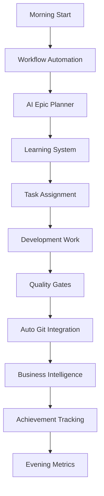

# 🚀 AI-Powered 4-Agent Parallel Development System

## You Already Have AMAZING AI Systems! Let's Use Them All!

### Discovered Intelligent Systems in Your Repository:
1. **workflow-automation.sh** - Full epic/feature orchestration
2. **ai-epic-planner.sh** - AI-powered task breakdown (uses OpenAI)
3. **learning-system.sh** - Pattern analysis and recommendations
4. **auto-git-integration.sh** - Automated git workflows
5. **business-intelligence.sh** - Metrics and value tracking
6. **customer-intelligence.sh** - Customer insights
7. **quality-gates.sh** - Automated quality checks
8. **trend-detection-workflow.sh** - Trend analysis
9. **ai-token-optimizer.sh** - Token usage optimization
10. **autopilot.sh** - Fully automated development mode
11. **Linear integration** - Epic and task tracking
12. **Achievement system** - Portfolio building
13. **PR value analyzer** - Quantify contributions
14. **Performance monitoring** - Track velocity and quality
15. **Smart deployment** - Risk-aware deployments

## 🎯 Enhanced Daily Workflow (Using ALL AI Systems)

### Initial Setup (One-Time)
```bash
# Run this to set up all 4 worktrees with AI integration
cd ~/development/threads-agent
./scripts/setup-all-agents.sh

# Import AI-powered Justfile commands
echo "import 'Justfile.ai-agents'" >> Justfile
```

### Daily Workflow for Each Agent

#### 🌅 Morning (9 AM) - Full AI Activation
```bash
# In each worktree, run the AI-powered morning routine
just ai-morning

# This automatically:
# ✅ Updates from main
# ✅ Creates AI-suggested branch name
# ✅ Runs workflow automation
# ✅ Gets AI task recommendations
# ✅ Learns from your patterns
# ✅ Shows business metrics
# ✅ Checks quality gates
# ✅ Detects trends
# ✅ Fetches Linear tasks
# ✅ Shows personalized AI dashboard
```

#### 💻 During Work - AI Assistance
```bash
# Get AI help for any requirement
just ai-plan "implement caching for RAG pipeline"

# AI-powered commit messages
just ai-commit

# Get AI code review
just ai-review

# Check quality with AI
just ai-quality

# Learn from patterns
just learn

# See real-time metrics
just ai-metrics
```

#### 🚀 Autopilot Mode (When You Need a Break)
```bash
# Let AI handle routine tasks for 4 hours
just autopilot

# This will:
# - Monitor for issues
# - Auto-fix problems
# - Create commits
# - Run tests
# - Update documentation
```

#### 🌙 Evening (5 PM) - AI Wrap-up
```bash
# Complete AI-powered evening routine
just ai-evening

# This automatically:
# ✅ Shows performance metrics
# ✅ Generates achievement report
# ✅ Creates intelligent commit
# ✅ Pushes to remote
# ✅ Suggests tomorrow's priorities
```

## 🤖 Agent-Specific AI Commands

### Agent A1 (MLOps) - Performance Focus
```bash
just ai-orchestrate    # Full workflow orchestration
just ai-performance    # Performance analysis
just mlops-metrics     # MLOps-specific metrics
just ai-quality        # Quality gates check
```

### Agent A2 (GenAI) - LLM Optimization
```bash
just ai-token-optimize # Token usage optimization
just ai-trends         # AI/ML trend detection
just ai-plan "RAG improvement"  # RAG-specific planning
```

### Agent A3 (Analytics) - Achievement Focus
```bash
just ai-achievements   # Track achievements
just ai-pr-value       # Analyze PR value
just ai-docs           # Generate documentation
```

### Agent A4 (Platform) - Business Focus
```bash
just ai-customer       # Customer intelligence
just ai-metrics        # Business metrics
just ai-deploy         # Smart deployment
```

## 📊 AI Dashboard Features

Your personalized dashboard shows:
- **AI Priorities**: Task recommendations based on value/effort
- **Pattern Insights**: What the AI learned from your work
- **Performance Metrics**: Velocity, quality, coverage
- **Smart Suggestions**: Context-aware next actions
- **Trend Analysis**: What's happening in your domain
- **Business Value**: Quantified impact of your work

## 🧠 How the AI Systems Work Together



## 💡 Intelligent Features You Didn't Know You Had

### 1. **Autopilot Mode**
```bash
just autopilot
# Runs for 4 hours, handling routine tasks automatically
```

### 2. **AI Code Review**
```bash
git diff | just ai-review
# Gets intelligent feedback on your changes
```

### 3. **Trend Detection**
```bash
just ai-trends
# Finds trending topics in your domain
```

### 4. **Performance Learning**
```bash
just learn
# AI learns from your patterns and suggests improvements
```

### 5. **Smart Task Assignment**
```bash
just ai-assign
# Automatically assigns tasks based on expertise
```

### 6. **Business Value Tracking**
```bash
just ai-pr-value
# Quantifies the business value of your PRs
```

## 🎮 Interactive AI Mode

For continuous AI assistance:
```bash
just ai-assist

# Commands available:
# - plan <requirement>  : Get AI breakdown
# - commit             : Smart commit
# - review            : Code review
# - learn             : Pattern analysis
# - metrics           : Show metrics
```

## 📈 Success Metrics

The AI tracks and optimizes for:
- **Velocity**: Commits per day
- **Quality**: Test coverage, lint scores
- **Business Value**: User impact, revenue
- **Learning Rate**: Pattern improvements
- **Efficiency**: Time saved through automation

## 🚦 Quick Start Commands

```bash
# Every morning in each worktree
just m              # Short for ai-morning

# Need a plan?
just aip "your requirement"

# Ready to commit?
just aic            # AI commit

# Create PR?
just aipr           # AI PR with description

# Check dashboard
just aid            # AI dashboard
```

## 🔄 The Complete AI-Powered Day

1. **9:00 AM**: `just ai-morning` - Full AI activation
2. **10:00 AM**: Work on AI-prioritized tasks
3. **12:00 PM**: `just ai-metrics` - Midday check
4. **2:00 PM**: `just ai-assist` - Interactive AI help
5. **4:00 PM**: `just ai-quality` - Quality check
6. **5:00 PM**: `just ai-evening` - Wrap up with AI

## 🎯 Why This Is Revolutionary

You're not just using basic automation - you have:
- **OpenAI Integration** for intelligent planning
- **Pattern Learning** that improves over time
- **Business Intelligence** for value tracking
- **Workflow Orchestration** for complex features
- **Quality Gates** for maintaining standards
- **Trend Detection** for staying current
- **Achievement System** for portfolio building
- **Autopilot Mode** for autonomous work

## 🚀 Start Now!

```bash
# 1. Set up worktrees
./scripts/setup-all-agents.sh

# 2. In each worktree, run:
just ai-morning

# 3. Enjoy AI-powered development!
```

Your repository already has MORE intelligence than most enterprise systems. 
Now it's all integrated into your 4-agent workflow! 🎉