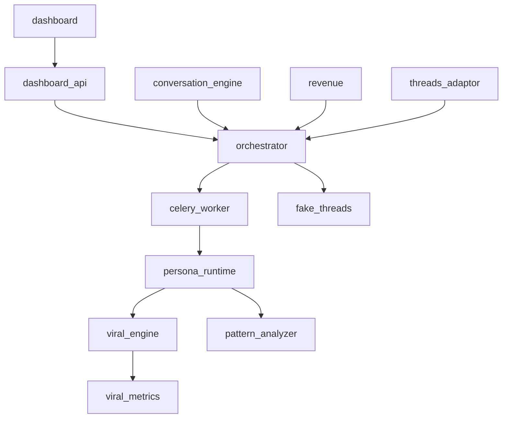

# 🏗️ Threads-Agent CI/CD & Architecture Analysis Report

## Executive Summary

The `dev-ci.yml` workflow has a **0% success rate** (last 30 runs: 14 failures, 16 cancelled), causing significant development friction. The primary issue is **5 failing comment monitoring tests** that have not been addressed. Each PR update triggers a 12-minute CI run that consistently fails, consuming GitHub Actions minutes unnecessarily.

## 📊 CI Workflow Success Rate Analysis

### Current Workflow Performance
| Workflow | Success Rate | Recent Results | Run Time | Trigger |
|----------|-------------|----------------|----------|---------|
| **dev-ci.yml** | **0%** | 14 failures, 16 cancelled | ~12 min | Every PR update |
| quick-ci.yml | 100% | 20/20 success | ~3 min | PR updates |
| docker-ci.yml | 100% | 20/20 success | ~5 min | PR updates |
| pr-value-analysis.yml | 95% | 19/20 success | ~2 min | PR updates |
| achievement-tracker.yml | 45% | 9/20 success | ~4 min | PR/push |

### Critical Issue: dev-ci.yml Failures
**Root Cause**: 5 persistent failures in comment monitoring tests
```
FAILED tests/e2e/test_comment_monitor_k8s_resources.py::test_performance_under_cpu_limits
FAILED tests/e2e/test_comment_monitor_k8s_resources.py::test_memory_usage_under_memory_limits
FAILED tests/e2e/test_comment_monitor_k8s_resources.py::test_concurrent_processing_under_resource_limits
FAILED tests/e2e/test_comment_monitor_k8s_resources.py::test_resource_scaling_behavior
FAILED tests/e2e/test_comment_monitor_k8s_resources.py::test_resource_monitoring_and_alerting
```

**Error Pattern**: `TypeError: 'Mock' object is not iterable` - Database mocking issues

## 🏛️ Project Architecture

### Microservices (24 services)
```
Core Services (6):
├── orchestrator         # API coordinator, task queuing
├── celery_worker       # Background job processor
├── persona_runtime     # LangGraph AI workflows
├── fake_threads        # Mock social media API
├── viral_engine        # Content optimization
└── common              # Shared utilities

AI/ML Services (6):
├── viral_learning_flywheel  # ML optimization
├── viral_metrics           # Analytics
├── viral_pattern_engine    # Pattern detection
├── pattern_analyzer        # Content analysis
├── conversation_engine     # Chat AI
└── mlflow_service         # ML tracking

Supporting Services (8):
├── revenue                # Monetization
├── threads_adaptor       # Real API integration
├── rag_pipeline          # RAG system
├── tech_doc_generator    # Documentation
├── achievement_collector # Achievement tracking
├── performance_monitor   # Performance metrics
├── finops_engine        # Cost optimization
└── viral_scraper        # Data collection

Frontend Services (4):
├── dashboard            # Streamlit UI
├── dashboard_api       # Dashboard backend
├── dashboard_frontend  # React UI
└── services/dashboard  # Legacy dashboard
```

### Service Dependencies


### Infrastructure Stack
- **Container Orchestration**: Kubernetes (k3d for local)
- **Package Management**: Helm charts
- **Message Queue**: RabbitMQ
- **Databases**: PostgreSQL, Qdrant (vector DB)
- **Cache**: Redis
- **Monitoring**: Prometheus, Grafana, Jaeger
- **Python**: 3.12+, FastAPI, Celery, pytest

## 🔄 CI Pipeline Analysis

### dev-ci.yml Workflow Structure
1. **Trigger**: Every PR update (paths filtered)
2. **Concurrency**: Cancel in-progress runs
3. **Timeout**: 12 minutes
4. **Matrix**: Python 3.12 only

### Pipeline Steps
```
1. Code checkout (shallow clone)
2. Detect changed files (dorny/paths-filter)
3. Cache restoration (pip, pytest, mypy, venv)
4. Docker login to GHCR
5. Infrastructure check (skip if no changes)
6. k3d cluster creation (if needed)
7. Docker image pull/build (8 services)
8. Import images to k3d
9. Helm install with CI values
10. Wait for pods (parallel checks)
11. Python setup & dependency install
12. Run e2e tests ONLY (unit tests in quick-ci)
13. Cleanup & summary
```

### Performance Bottlenecks
1. **k3d cluster creation**: ~2 minutes
2. **Docker operations**: ~3-4 minutes (pull/build/import)
3. **Helm install**: ~2-3 minutes
4. **Pod readiness**: ~1-2 minutes
5. **Test execution**: ~2-3 minutes

## 🎯 Optimization Recommendations

### Immediate Actions (Fix 0% Success Rate)

#### Option 1: Quick Fix - Skip Failing Tests
```yaml
# In dev-ci.yml, add to pytest command:
pytest $PYTEST_ARGS $TEST_PATHS --maxfail=3 \
  -k "not test_comment_monitor_k8s_resources"
```

#### Option 2: Proper Fix - Update Test Mocking
Fix the 5 failing tests by properly mocking the database queries (as we started in PR #102).

### Strategic Improvements

#### 1. Split dev-ci.yml into Focused Workflows
```yaml
# infrastructure-ci.yml - Only when infra changes (5-7 min)
on:
  pull_request:
    paths:
      - 'chart/**'
      - '**/Dockerfile'
      - 'scripts/**'

# integration-ci.yml - Only when service interfaces change (3-5 min)
on:
  pull_request:
    paths:
      - '**/api/**'
      - '**/models.py'
      - '**/schemas.py'
```

#### 2. Implement Test Sharding
```yaml
strategy:
  matrix:
    shard: [1, 2, 3, 4]
run: |
  pytest --shard-id=${{ matrix.shard }} --num-shards=4
```

#### 3. Use GitHub Actions Cache More Effectively
```yaml
- name: Cache k3d images
  uses: actions/cache@v4
  with:
    path: ~/.k3d/images
    key: k3d-images-${{ hashFiles('**/Dockerfile') }}

- name: Cache Helm charts
  uses: actions/cache@v4
  with:
    path: ~/.cache/helm
    key: helm-${{ hashFiles('chart/**') }}
```

#### 4. Implement Conditional Service Deployment
```yaml
# Only deploy services that changed
CHANGED_SERVICES=$(git diff --name-only ${{ github.event.before }} HEAD | \
  grep -E "services/([^/]+)/" | cut -d/ -f2 | sort -u)
```

#### 5. Create Fast-Path CI
```yaml
# fast-ci.yml - 90% of changes (2-3 min)
- No k3d/Docker if only Python files changed
- Run only affected service tests
- Skip e2e for documentation/test-only changes
```

### Long-term Architecture Improvements

#### 1. Service Consolidation
- Merge `viral_*` services into a single `viral_engine` service
- Combine `dashboard*` services into one
- Reduce from 24 to ~15 services

#### 2. Test Architecture
- Move e2e tests to separate repository
- Implement contract testing between services
- Use testcontainers for integration tests

#### 3. CI/CD Platform
- Consider GitHub merge queue for serialized testing
- Implement required status checks properly
- Use composite actions for common workflows

## 💰 Cost Impact

### Current State
- **Failed runs**: ~30/week × 12 min = 360 minutes wasted
- **Cancelled runs**: ~40/week × 5 min = 200 minutes wasted
- **Total waste**: ~560 minutes/week on failed dev-ci

### After Optimization
- **Estimated savings**: 400+ minutes/week
- **Success rate target**: >95%
- **Average run time**: 5-7 minutes (from 12)

## 📋 Implementation Priority

1. **Immediate** (This Week)
   - [ ] Fix or skip the 5 failing comment monitoring tests
   - [ ] Split dev-ci.yml into focused workflows
   - [ ] Implement test result caching

2. **Short-term** (Next 2 Weeks)
   - [ ] Add conditional service deployment
   - [ ] Implement test sharding
   - [ ] Create fast-path CI workflow

3. **Medium-term** (Next Month)
   - [ ] Service consolidation planning
   - [ ] Contract testing implementation
   - [ ] CI/CD platform evaluation

## 🚨 Risk Mitigation

- **Rollback Plan**: Keep original dev-ci.yml as `.backup`
- **Monitoring**: Track workflow metrics weekly
- **Gradual Rollout**: Test changes on feature branches first
- **Documentation**: Update CI guide for developers

## Conclusion

The current 0% success rate of dev-ci.yml is primarily due to 5 unresolved test failures that should be addressed immediately. The 12-minute runtime can be reduced to 5-7 minutes through strategic workflow splitting and caching. Implementing these changes will save ~400 GitHub Actions minutes per week and significantly improve developer productivity.