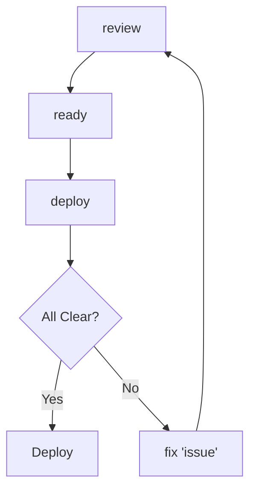

# 🤖 Claude Code Development Guide

> **Complete guide for token-efficient, AI-assisted development with Claude Code and MCP servers for the Threads-Agent Stack project.**

## 📋 Table of Contents

- [🚀 Quick Start](#-quick-start)
- [🛠️ Setup Overview](#️-setup-overview)
- [📅 Daily Workflows](#-daily-workflows)
- [🎯 Epic-Specific Development](#-epic-specific-development)
- [📊 Sprint Planning & Task Management](#-sprint-planning--task-management)
- [🏗️ Architecture & Code Generation](#️-architecture--code-generation)
- [🚀 Deployment & Operations](#-deployment--operations)
- [💡 Token-Efficient Usage Patterns](#-token-efficient-usage-patterns)
- [📖 Complete Alias Reference](#-complete-alias-reference)
- [🔧 Best Practices](#-best-practices)
- [🛠️ Troubleshooting](#️-troubleshooting)

## 🚀 Quick Start

```bash
# Start your development session
session

# Get immediate next action
next

# Generate code for current task
code "FastAPI health check endpoint"

# Create Linear tasks for current sprint
task
```

## 🛠️ Setup Overview

### Required MCP Servers

| Server              | Purpose                                | Status      |
| ------------------- | -------------------------------------- | ----------- |
| **File System MCP** | Project code and structure access      | ✅ Required |
| **GitHub MCP**      | Repository, commits, and PR management | ✅ Required |
| **PostgreSQL MCP**  | Database schema and query capabilities | ✅ Required |
| **Linear MCP**      | Task management and project planning   | ✅ Required |

### Core Scripts

| Script                     | Purpose                         | Key Commands                                  |
| -------------------------- | ------------------------------- | --------------------------------------------- |
| `scripts/efficient-dev.sh` | Core development commands       | `next`, `code`, `fix`, `task`, `review`       |
| `scripts/batch-queries.sh` | Token-saving batch operations   | `sprint-prep`, `deploy-prep`, `debug-batch`   |
| `scripts/smart-queries.sh` | Context-aware queries using MCP | `schema-code`, `test-current`, `deploy-check` |

### Validation

```bash
# Verify your setup
validate

# Check MCP servers
claude mcp list
```

## 📅 Daily Workflows

### 🌅 Morning Startup Routine

```bash
# 1. Start development session (sets up port forwards, environment)
session

# 2. Get immediate priorities and focus
next

# 3. Review current sprint status
sprint
```

### 🔄 Active Development Cycle

```bash
# Generate specific code using database context
schema-api "user authentication endpoints"

# Create code following existing patterns
api-code "CRUD operations for posts"

# Generate tests for recent changes
test-now

# Debug specific issues
fix "celery worker memory leak"
```

### 🌆 End-of-Day Review

```bash
# Review today's work
review

# Check deployment readiness
ready

# Quick status update
git-status
```

## 🎯 Epic-Specific Development

### E2 Core MVP Development

> **Focus**: Orchestrator API + Persona Runtime implementation

```bash
# Get current E2 priorities
linear-focus

# Generate orchestrator endpoints using database schema
schema-api "orchestrator task queue endpoints"

# Create persona runtime workflow code
code "LangGraph DAG for persona content generation"

# Generate Post model CRUD operations
api-model "Post"

# Create tests for new implementations
test-now

# Review implementation against E2 requirements
review
```

**Key E2 Development Pattern:**

```bash
linear-focus → schema-api → code → test-now → review
```

### E3 Threads Adaptor Development

> **Focus**: A/B testing and Threads API integration

```bash
# Check current E3 focus
next

# Generate Threads API client with retry logic
code "threads API client with token bucket rate limiting"

# Create A/B variant tracking using database
schema-api "A/B variant tracking and analytics"

# Debug Threads API integration issues
debug-batch "threads API rate limiting errors"

# Validate A/B testing implementation
ready
```

### E4+ Observability & Advanced Features

> **Focus**: Monitoring, FinOps, and production readiness

```bash
# Generate monitoring and metrics code
code "Prometheus metrics collection for content generation"

# Create FinOps cost tracking
api-code "FinOps cost tracking endpoints with token usage"

# Batch deployment preparation
deploy

# Review observability implementation
review
```

## 📊 Sprint Planning & Task Management

### 📋 Sprint Preparation

```bash
# Comprehensive sprint planning (single efficient query)
sprint

# Generate specific Linear tasks for current epic
task

# Break down complex features based on existing models
api-model "User"  # Analyze User model and suggest related tasks
```

### 🔄 Task Breakdown Process


**Step-by-step workflow:**

1. **Identify focus**: `linear-focus`
2. **Generate tasks**: `task`
3. **Implement**: `code "specific requirement"`
4. **Test**: `test-now`
5. **Review**: `review`
6. **Validate**: `ready`

### 🎯 Task Creation Patterns

```bash
# Generate tasks for current Linear project
task

# Create specific implementation tasks
code "FastAPI health check with database validation"

# Generate testing tasks
test-now

# Create deployment preparation tasks
deploy
```

## 🏗️ Architecture & Code Generation

### 🗃️ Database-Driven Development

```bash
# Leverage PostgreSQL MCP for schema-aware code generation
schema-api "user management CRUD endpoints"

# Generate database-context aware pagination
db-code "pagination for posts table with filtering"

# Create API endpoints from existing models
api-model "Task"  # Generate CRUD operations for Task model
```

### 🔧 Microservices Development

| Service             | Command Pattern                    | Example                                           |
| ------------------- | ---------------------------------- | ------------------------------------------------- |
| **Orchestrator**    | `code "orchestrator [feature]"`    | `code "orchestrator health check endpoint"`       |
| **Celery Worker**   | `code "celery [feature]"`          | `code "celery worker task processing with retry"` |
| **Persona Runtime** | `code "persona-runtime [feature]"` | `code "persona-runtime LangGraph workflow"`       |
| **Cross-Service**   | `api-code "[integration]"`         | `api-code "service-to-service communication"`     |

### 🧪 Testing & Quality Assurance

```bash
# Generate tests for current work
test-now

# Review code quality and identify improvements
review

# Check deployment readiness
ready

# Comprehensive debugging for complex issues
debug-batch "end-to-end content generation pipeline failure"
```

## 🚀 Deployment & Operations

### 📦 Pre-Deployment Workflow



```bash
# 1. Review recent changes
review

# 2. Quick deployment validation
ready

# 3. Batch deployment preparation
deploy

# 4. Fix any identified issues
fix "specific deployment issue"
```

### 🔍 Production Support

```bash
# Debug production issues with full context
fix "high latency in orchestrator service"

# Comprehensive production debugging
debug-batch "celery queue backlog causing delays"

# Quick system health check
c-quick "Are all services healthy and responding normally?"

# Check recent changes that might affect production
git-status
```

## 💡 Token-Efficient Usage Patterns

### ✅ High-Value Token Spending

| Pattern                      | Example                                               | Benefit                        |
| ---------------------------- | ----------------------------------------------------- | ------------------------------ |
| **Specific Code Generation** | `code "FastAPI endpoint for user signup with JWT"`    | Precise, actionable output     |
| **Context-Aware APIs**       | `schema-api "posts pagination with filtering"`        | Leverages database context     |
| **Model-Based Development**  | `api-model "User"`                                    | Uses existing patterns         |
| **Targeted Debugging**       | `fix "PostgreSQL connection timeout in orchestrator"` | Focused problem-solving        |
| **Batch Planning**           | `sprint`                                              | Multiple insights in one query |

### ❌ Token Waste to Avoid

| ❌ Avoid                                        | ✅ Use Instead                     | Why                       |
| ----------------------------------------------- | ---------------------------------- | ------------------------- |
| `claude "How's my project going?"`              | `next`                             | Vague vs. actionable      |
| `claude "Explain microservices best practices"` | `api-code "service communication"` | Theoretical vs. practical |
| `claude "Tell me about my architecture"`        | `schema-api "current endpoint"`    | Uses MCP context          |

### 🔄 Progressive Complexity Pattern

```bash
# 🟢 Level 1: Quick check (minimal tokens)
c-quick "Is current task ready for implementation?"

# 🟡 Level 2: Specific guidance (targeted tokens)
next  # Get immediate next action
code "specific requirement"  # Generate targeted code

# 🔴 Level 3: Comprehensive help (focused but detailed)
debug-batch "specific complex issue"  # Full debugging context
```

## 📖 Complete Alias Reference

### 🔧 Core Development Commands

| Alias    | Full Command                        | Purpose                   | Usage Example            |
| -------- | ----------------------------------- | ------------------------- | ------------------------ |
| `next`   | `./scripts/efficient-dev.sh next`   | Get immediate next action | `next`                   |
| `code`   | `./scripts/efficient-dev.sh code`   | Generate specific code    | `code "health endpoint"` |
| `fix`    | `./scripts/efficient-dev.sh fix`    | Debug specific issue      | `fix "database timeout"` |
| `task`   | `./scripts/efficient-dev.sh task`   | Generate Linear tasks     | `task`                   |
| `review` | `./scripts/efficient-dev.sh review` | Review recent commits     | `review`                 |

### 📦 Batch Operations (Token Savers)

| Alias         | Full Command                             | Purpose                 | Usage Example              |
| ------------- | ---------------------------------------- | ----------------------- | -------------------------- |
| `sprint`      | `./scripts/batch-queries.sh sprint-prep` | Sprint planning batch   | `sprint`                   |
| `deploy`      | `./scripts/batch-queries.sh deploy-prep` | Deployment preparation  | `deploy`                   |
| `debug-batch` | `./scripts/batch-queries.sh debug-batch` | Comprehensive debugging | `debug-batch "API errors"` |

### 🧠 Context-Leveraging Shortcuts

| Alias        | Full Command                                | Purpose                           | Usage Example                 |
| ------------ | ------------------------------------------- | --------------------------------- | ----------------------------- |
| `schema-api` | `./scripts/smart-queries.sh schema-code`    | Generate API using DB schema      | `schema-api "user endpoints"` |
| `api-model`  | `./scripts/smart-queries.sh api-from-model` | Generate CRUD from model          | `api-model "Post"`            |
| `test-now`   | `./scripts/smart-queries.sh test-current`   | Generate tests for recent changes | `test-now`                    |
| `ready`      | `./scripts/smart-queries.sh deploy-check`   | Quick deployment check            | `ready`                       |

### 🎯 Targeted Queries

| Alias     | Full Command                        | Purpose                 | Usage Example               |
| --------- | ----------------------------------- | ----------------------- | --------------------------- |
| `c-quick` | `claude "Answer in 1-2 sentences:"` | Force concise responses | `c-quick "Is E2 on track?"` |
| `c-code`  | `claude "Code only:"`               | Get code only           | `c-code "health check"`     |
| `c-fix`   | `claude "Solution only:"`           | Get solution only       | `c-fix "timeout issue"`     |

### 🔄 Context Shortcuts

| Alias          | Full Command                                               | Purpose              | Usage Example               |
| -------------- | ---------------------------------------------------------- | -------------------- | --------------------------- |
| `db-code`      | `claude "Based on my PostgreSQL schema, generate:"`        | Use database context | `db-code "user signup"`     |
| `api-code`     | `claude "Following my existing FastAPI patterns, create:"` | Use API patterns     | `api-code "CRUD endpoints"` |
| `linear-focus` | `claude "Current Linear project priority..."`              | Get Linear focus     | `linear-focus`              |
| `git-status`   | `claude "Recent commits summary..."`                       | Get git summary      | `git-status`                |

### 🛠️ Session Management

| Alias      | Full Command                  | Purpose                   | Usage Example |
| ---------- | ----------------------------- | ------------------------- | ------------- |
| `session`  | `./scripts/start-session.sh`  | Start development session | `session`     |
| `validate` | `./scripts/validate-setup.sh` | Validate setup            | `validate`    |

## 🔧 Best Practices

### 🎯 Context Leverage Over Explanation

```bash
# ✅ Efficient (uses MCP context automatically)
schema-api "user authentication endpoints"

# ❌ Inefficient (wastes tokens explaining schema)
claude "I have a users table with id, email, password columns... create authentication endpoints"
```

### 🚀 Action-First Queries

```bash
# ✅ Efficient (action-oriented)
next  # "What should I work on next?"
code "health check endpoint"  # Specific implementation

# ❌ Inefficient (discussion-oriented)
claude "What are the pros and cons of different approaches to health checks..."
```

### 📦 Batch Related Operations

```bash
# ✅ Efficient (batched)
sprint  # Gets status + tasks + blockers in one query

# ❌ Inefficient (multiple queries)
claude "What's my Linear status?"
claude "What tasks should I work on?"
claude "Any blockers?"
```

### 🔄 Progressive Complexity

```bash
# Start minimal, add complexity only when needed
c-quick "simple question"     # Level 1: Minimal tokens
code "specific requirement"   # Level 2: Targeted implementation
debug-batch "complex issue"   # Level 3: Full context when stuck
```

## 🛠️ Troubleshooting

### 🔌 MCP Server Issues

```bash
# Validate complete setup
validate

# Check all MCP servers
claude mcp list

# Restart development session
session
```

### 🪙 Token Usage Optimization

| Issue                       | Solution             | Command                      |
| --------------------------- | -------------------- | ---------------------------- |
| **Too verbose responses**   | Use targeted queries | `c-quick`, `c-code`, `c-fix` |
| **Repetitive explanations** | Leverage MCP context | `schema-api`, `db-code`      |
| **Multiple small queries**  | Use batch operations | `sprint`, `deploy`           |

### 🔄 Development Workflow Issues

```bash
# Lost focus or direction
linear-focus  # Get current Linear priority
next         # Get immediate next action

# Unsure about current state
git-status   # Recent changes summary
ready        # Deployment readiness check

# Stuck on implementation
fix "specific issue"           # Targeted debugging
debug-batch "complex problem"  # Comprehensive analysis
```

### 🚨 Common Error Patterns

| Error                       | Likely Cause           | Solution                |
| --------------------------- | ---------------------- | ----------------------- |
| `Script not found`          | Scripts not executable | `chmod +x scripts/*.sh` |
| `MCP server not responding` | Port forward down      | `session`               |
| `Alias not found`           | Shell not reloaded     | `source ~/.zshrc`       |

---

## 📚 Additional Resources

- **Project Documentation**: See `CLAUDE.md` for complete project context
- **Setup Guide**: See main `README.md` for initial setup instructions
- **Epic Planning**: See Linear workspace for current priorities

> **💡 Pro Tip**: This workflow maximizes development velocity while minimizing token usage through intelligent context leverage and progressive complexity patterns.

---

**Last Updated**: 2025-07-19
**Maintained by**: Threads-Agent Stack Development Team
