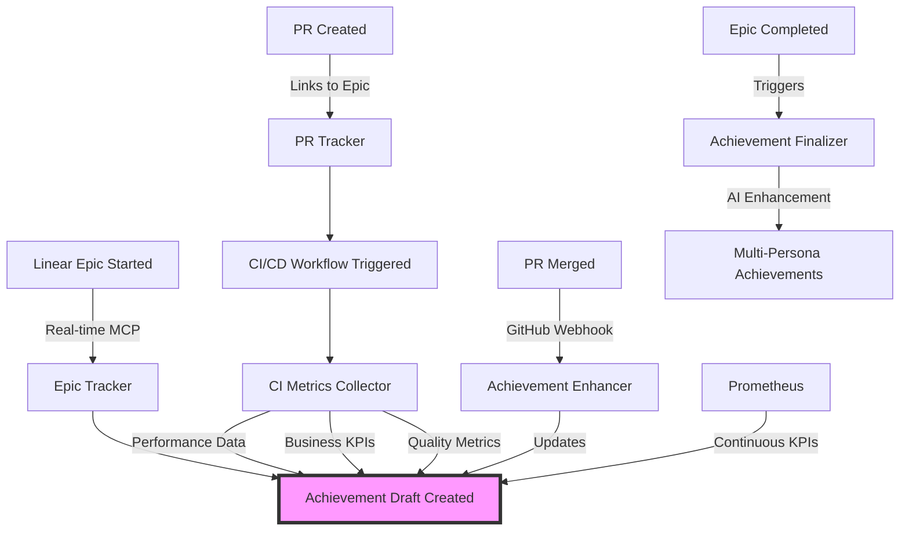

# Unified Achievement Tracking System: Linear Epics + CI/CD + PR Tracking

## System Integration Overview



## How They Work Together

### 1. Epic-PR-CI Integration Flow

```python
# services/achievement_collector/integrations/unified_tracker.py

class UnifiedAchievementTracker:
    """Orchestrates all tracking systems for comprehensive achievements."""
    
    def __init__(self):
        self.epic_tracker = EnhancedLinearTracker()
        self.pr_tracker = GitHubPRTracker()
        self.ci_collector = CIMetricsCollector()
        self.achievement_aggregator = AchievementAggregator()
        
    async def track_development_work(self, epic_id: str):
        """Track all aspects of development work."""
        
        # 1. Start epic tracking
        epic_draft = await self.epic_tracker.start_epic_tracking(epic_id)
        
        # 2. Monitor PRs linked to epic
        pr_monitor = asyncio.create_task(
            self._monitor_epic_prs(epic_id, epic_draft)
        )
        
        # 3. Collect CI/CD metrics for each PR
        ci_monitor = asyncio.create_task(
            self._monitor_ci_metrics(epic_id, epic_draft)
        )
        
        # 4. Aggregate all data
        await asyncio.gather(pr_monitor, ci_monitor)
        
        return epic_draft
    
    async def _monitor_epic_prs(self, epic_id: str, epic_draft: Dict):
        """Monitor all PRs associated with an epic."""
        
        while True:
            # Get PRs that reference this epic
            prs = await self._get_prs_for_epic(epic_id)
            
            for pr in prs:
                if pr['state'] == 'merged' and pr['number'] not in epic_draft['merged_prs']:
                    # PR just merged - collect its metrics
                    pr_metrics = await self.pr_tracker._process_pr(pr)
                    
                    # Add PR achievement to epic
                    epic_draft['merged_prs'][pr['number']] = pr_metrics
                    
                    # Update epic metrics
                    await self._update_epic_metrics(epic_id, pr_metrics)
            
            await asyncio.sleep(300)  # Check every 5 minutes
    
    async def _monitor_ci_metrics(self, epic_id: str, epic_draft: Dict):
        """Monitor CI/CD metrics for epic PRs."""
        
        while True:
            for pr_number in epic_draft['merged_prs']:
                # Get latest CI run for PR
                ci_run = await self._get_latest_ci_run(pr_number)
                
                if ci_run and ci_run['id'] not in epic_draft['ci_runs']:
                    # New CI run completed
                    ci_metrics = await self.ci_collector.collect_all_metrics(
                        pr_number, 
                        ci_run['sha']
                    )
                    
                    # Add to epic achievement
                    epic_draft['ci_runs'][ci_run['id']] = ci_metrics
                    
                    # Extract KPIs
                    kpis = self._extract_kpis_from_ci(ci_metrics)
                    epic_draft['kpis'].update(kpis)
            
            await asyncio.sleep(600)  # Check every 10 minutes
```

### 2. Enhanced GitHub Actions Workflow

Update the CI workflow to link with Linear epics:

```yaml
# .github/workflows/achievement-tracker.yml

name: Unified Achievement Tracker

on:
  pull_request:
    types: [opened, closed]
  push:
    branches: [main]

jobs:
  track-achievement:
    runs-on: ubuntu-latest
    
    steps:
      - name: Extract Linear Epic ID
        id: epic_extraction
        run: |
          # Extract epic ID from PR body or branch name
          EPIC_ID=$(echo "${{ github.event.pull_request.body }}" | grep -oP 'Epic:\s*\K[A-Z0-9-]+' || true)
          
          if [ -z "$EPIC_ID" ]; then
            # Try branch name
            EPIC_ID=$(echo "${{ github.head_ref }}" | grep -oP 'epic-\K[A-Z0-9-]+' || true)
          fi
          
          echo "epic_id=$EPIC_ID" >> $GITHUB_OUTPUT
      
      - name: Link PR to Epic
        if: steps.epic_extraction.outputs.epic_id
        env:
          LINEAR_API_KEY: ${{ secrets.LINEAR_API_KEY }}
        run: |
          python3 << 'EOF'
          import os
          from services.achievement_collector.integrations.linear_mcp import LinearMCPIntegration
          
          epic_id = "${{ steps.epic_extraction.outputs.epic_id }}"
          pr_number = "${{ github.event.pull_request.number }}"
          
          # Link PR to Linear epic
          linear = LinearMCPIntegration()
          await linear.link_pr_to_epic(epic_id, pr_number)
          
          # Update epic achievement draft
          tracker = UnifiedAchievementTracker()
          await tracker.add_pr_to_epic(epic_id, pr_number)
          EOF
      
      - name: Collect Comprehensive Metrics
        # ... existing CI metrics collection ...
        
      - name: Update Epic Achievement
        if: github.event.pull_request.merged == true
        run: |
          python3 << 'EOF'
          # Update the epic achievement with PR + CI metrics
          epic_id = "${{ steps.epic_extraction.outputs.epic_id }}"
          if epic_id:
              updater = EpicAchievementUpdater()
              await updater.update_from_merged_pr(
                  epic_id,
                  pr_data=${{ toJson(github.event.pull_request) }},
                  ci_metrics=${{ steps.ci_metrics.outputs.all_metrics }}
              )
          EOF
```

### 3. Real-time Achievement Aggregation

```python
# services/achievement_collector/aggregators/epic_aggregator.py

class EpicAchievementAggregator:
    """Aggregates all data sources into comprehensive epic achievement."""
    
    async def aggregate_epic_achievement(self, epic_id: str) -> Dict:
        """Combine all tracking data into unified achievement."""
        
        # Get base epic data from Linear
        epic_data = await self._get_epic_data(epic_id)
        
        # Get all PRs for this epic
        pr_achievements = await self._get_pr_achievements(epic_id)
        
        # Get CI/CD metrics
        ci_metrics = await self._get_ci_metrics_for_epic(epic_id)
        
        # Get Prometheus KPIs
        prometheus_kpis = await self._get_prometheus_kpis(epic_id)
        
        # Aggregate into comprehensive achievement
        achievement = {
            "title": f"Epic: {epic_data['name']}",
            "description": epic_data['description'],
            "timeline": {
                "started": epic_data['startedAt'],
                "completed": epic_data['completedAt'],
                "phases": self._extract_phases(epic_data, pr_achievements)
            },
            "deliverables": {
                "features": self._extract_features(pr_achievements),
                "prs_merged": len(pr_achievements),
                "issues_completed": epic_data['completedIssues'],
                "code_changes": self._sum_code_changes(pr_achievements)
            },
            "metrics": {
                "technical": self._aggregate_technical_metrics(ci_metrics),
                "business": self._aggregate_business_metrics(prometheus_kpis),
                "quality": self._aggregate_quality_metrics(ci_metrics),
                "team": self._aggregate_team_metrics(pr_achievements)
            },
            "evidence": {
                "pr_links": [pr['url'] for pr in pr_achievements],
                "ci_reports": [run['url'] for run in ci_metrics],
                "screenshots": await self._collect_screenshots(epic_id),
                "documents": await self._collect_documents(epic_id)
            },
            "ai_enhancements": await self._generate_ai_enhancements(
                epic_data, 
                pr_achievements, 
                ci_metrics,
                prometheus_kpis
            )
        }
        
        return achievement
    
    def _aggregate_technical_metrics(self, ci_metrics: List[Dict]) -> Dict:
        """Aggregate technical metrics from all CI runs."""
        
        return {
            "avg_build_time": self._calculate_avg(ci_metrics, "build_time"),
            "test_coverage": self._calculate_max(ci_metrics, "coverage"),
            "performance_improvement": self._calculate_improvement(
                ci_metrics, 
                "performance_benchmarks"
            ),
            "code_quality_score": self._calculate_avg(ci_metrics, "quality_score"),
            "security_issues_fixed": self._sum_metric(ci_metrics, "security_fixes")
        }
    
    def _aggregate_business_metrics(self, prometheus_kpis: Dict) -> Dict:
        """Aggregate business KPIs from Prometheus."""
        
        return {
            "engagement_rate_improvement": prometheus_kpis.get("engagement_delta", 0),
            "revenue_impact": prometheus_kpis.get("revenue_projection_change", 0),
            "cost_savings": prometheus_kpis.get("operational_cost_reduction", 0),
            "user_satisfaction_increase": prometheus_kpis.get("csat_improvement", 0),
            "time_to_market_reduction": prometheus_kpis.get("ttm_improvement", 0)
        }
```

### 4. Unified Achievement Lifecycle

```python
# services/achievement_collector/lifecycle/unified_lifecycle.py

class UnifiedAchievementLifecycle:
    """Manages the complete lifecycle of epic achievements."""
    
    async def initialize_epic_tracking(self, epic_id: str):
        """Start tracking when epic begins."""
        
        # 1. Create achievement draft
        draft_id = await self._create_achievement_draft(epic_id)
        
        # 2. Set up all integrations
        await self._setup_linear_webhook(epic_id, draft_id)
        await self._setup_github_webhook(epic_id, draft_id)
        await self._setup_prometheus_alerts(epic_id, draft_id)
        
        # 3. Start background tasks
        asyncio.create_task(self._track_epic_progress(epic_id, draft_id))
        
        return draft_id
    
    async def handle_pr_event(self, pr_data: Dict, epic_id: str):
        """Handle PR events and update epic achievement."""
        
        draft = await self._get_achievement_draft(epic_id)
        
        if pr_data['action'] == 'opened':
            # PR opened - start tracking
            draft['active_prs'][pr_data['number']] = {
                'opened_at': pr_data['created_at'],
                'title': pr_data['title'],
                'description': pr_data['body']
            }
            
        elif pr_data['action'] == 'closed' and pr_data['merged']:
            # PR merged - collect all metrics
            pr_metrics = await self._collect_pr_metrics(pr_data)
            ci_metrics = await self._wait_for_ci_completion(pr_data['number'])
            
            # Update achievement draft
            draft['completed_prs'][pr_data['number']] = {
                **pr_metrics,
                'ci_metrics': ci_metrics,
                'impact_analysis': await self._analyze_pr_impact(pr_data, ci_metrics)
            }
            
            # Check if this completes a milestone
            milestone = await self._check_epic_milestone(epic_id, draft)
            if milestone:
                await self._record_milestone(epic_id, milestone)
        
        await self._save_achievement_draft(epic_id, draft)
    
    async def finalize_epic_achievement(self, epic_id: str):
        """Finalize achievement when epic completes."""
        
        # Get the complete draft with all data
        draft = await self._get_complete_draft(epic_id)
        
        # Generate final metrics
        final_metrics = await self._calculate_final_metrics(draft)
        
        # Create persona-specific versions
        achievements = {}
        for persona in ['technical', 'business', 'leadership']:
            achievements[persona] = await self._generate_persona_achievement(
                draft, 
                final_metrics, 
                persona
            )
        
        # Store in database
        achievement_id = await self._store_final_achievement(
            epic_id, 
            achievements, 
            final_metrics
        )
        
        # Trigger notifications
        await self._notify_achievement_complete(achievement_id)
        
        return achievement_id
```

### 5. Configuration for Unified System

```yaml
# config/achievement-tracker.yaml

tracking:
  epic_integration:
    enabled: true
    auto_link_prs: true
    track_phases: [planning, development, testing, deployment]
    
  pr_tracking:
    enabled: true
    min_changes: 50
    require_epic_link: true
    
  ci_integration:
    enabled: true
    collect_metrics: [performance, quality, security, coverage]
    wait_for_completion: true
    
  prometheus:
    enabled: true
    kpi_queries:
      - engagement_rate
      - revenue_projection
      - error_rate
      - latency_p99

aggregation:
  strategy: comprehensive
  update_frequency: real_time
  
  epic_completion:
    require_all_prs_merged: true
    require_ci_success: true
    auto_finalize: true

ai_enhancement:
  enabled: true
  generate_stories: true
  predict_impact: true
  personas: [hr_manager, tech_lead, startup_ceo, investor]
```

## Benefits of Unified System

1. **Complete Picture**: Every PR's metrics contribute to the epic achievement
2. **Real-time Updates**: Achievement builds progressively as work completes
3. **No Duplication**: PR achievements roll up into epic achievements
4. **Rich Context**: Combines Linear planning context with GitHub execution metrics
5. **Automated Flow**: Zero manual work required

## Example Workflow

```bash
# 1. Start epic in Linear
linear create-epic "Implement AI-Enhanced Search"

# 2. System automatically starts tracking
[Achievement Tracker] Epic E5.1 tracking initialized

# 3. Create PR with epic reference
git checkout -b epic-E5.1-ai-search
# ... make changes ...
gh pr create --title "feat: implement vector search" --body "Epic: E5.1"

# 4. CI runs and collects metrics
[CI/CD] Performance: 200ms → 50ms (75% improvement)
[CI/CD] Test Coverage: 85% → 92%

# 5. PR merges, updates epic achievement
[Achievement Tracker] PR #123 metrics added to Epic E5.1

# 6. Complete epic in Linear
[Achievement Tracker] Epic E5.1 finalized with:
- 5 PRs merged
- 300ms → 50ms search latency (83% improvement)  
- $15k/month cost savings
- 95% test coverage
- 3 team members collaborated

# 7. Get achievement in any format
achievement-collector export --epic E5.1 --persona tech-lead
```

The unified system ensures that all your work - from Linear planning through PR implementation to CI/CD validation - automatically creates comprehensive, evidence-based achievements.