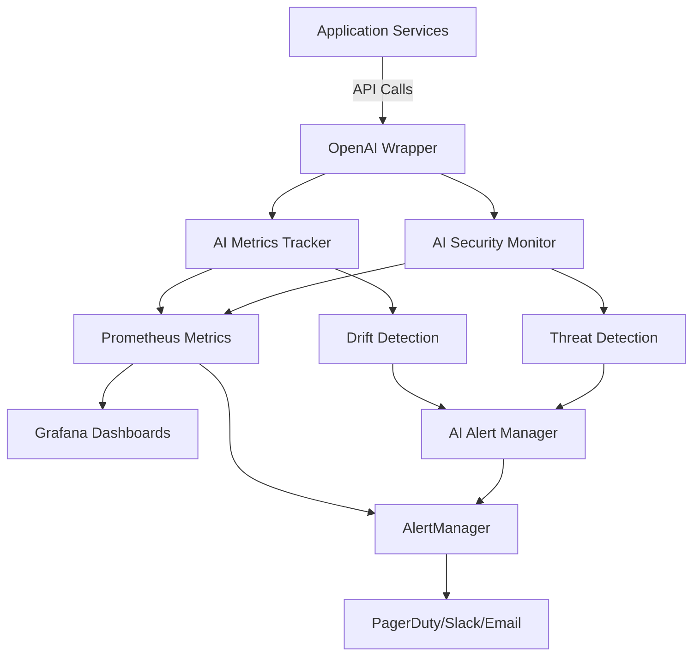

# AI Monitoring Technical Deep Dive

## Architecture Overview



## Component Deep Dive

### 1. AI Metrics Tracker (`ai_metrics.py`)

#### Design Decisions

**Rolling Window Approach**
```python
self.window_size = 1000  # Last 1000 requests
self.token_usage = deque(maxlen=window_size)
self.response_times = deque(maxlen=window_size)
```
- **Why**: Balances memory usage with statistical significance
- **Trade-off**: Older data dropped, but 1000 samples sufficient for percentiles

**Per-Model Tracking**
```python
self.model_metrics: Dict[str, Dict[str, deque]] = {}
```
- **Why**: Different models have different characteristics
- **Benefit**: Can set model-specific thresholds

**Cost Calculation**
```python
pricing = {
    'gpt-4': {'prompt': 0.03, 'completion': 0.06},
    'gpt-4o': {'prompt': 0.005, 'completion': 0.015},
    'gpt-3.5-turbo': {'prompt': 0.0005, 'completion': 0.0015}
}
```
- **Why**: Hardcoded for speed and reliability
- **Maintenance**: Update quarterly with OpenAI pricing

#### Drift Detection Algorithm

```python
def _detect_confidence_drift(self) -> str:
    recent = list(self.confidence_scores)[-100:]
    previous = list(self.confidence_scores)[-200:-100]
    
    drift_percentage = ((previous_avg - recent_avg) / previous_avg) * 100
    
    if abs(drift_percentage) > 15:
        return f"significant_drift_{drift_percentage:+.1f}%"
```

**Algorithm Choice**: 
- Simple moving average comparison
- No ML model needed (avoiding inception problem)
- Interpretable for ops teams

**Thresholds**:
- 5%: Minor drift (info only)
- 10%: Moderate drift (warning)
- 15%: Significant drift (critical)

### 2. AI Security Monitor (`ai_safety.py`)

#### Prompt Injection Detection

**Pattern-Based Approach**:
```python
self.prompt_injection_patterns = [
    (r"ignore previous instructions", "override_attempt", "high"),
    (r"system:\s*", "role_injection", "high"),
    (r"<\|.*?\|>", "special_tokens", "high"),
]
```

**Why Not ML-Based Detection?**:
1. Deterministic - no false negatives for known patterns
2. Fast - regex matching in microseconds
3. Explainable - can show exactly what triggered
4. No training data needed

#### Hallucination Detection

**Risk-Based Categories**:
```python
'medical': {
    'patterns': [r'diagnos', r'treatment', r'prescription'],
    'risk_level': 'critical'
},
'financial': {
    'patterns': [r'\$[\d,]+(?:\.\\d+)?(?:B|M|K)?', r'revenue'],
    'risk_level': 'high'
}
```

**Confidence Adjustment**:
```python
confidence_adjustments = {
    'low': 0.95,
    'medium': 0.85,
    'high': 0.7,
    'critical': 0.5
}
```
- Not blocking, but reducing confidence
- Allows system to continue serving
- Flags for human review

### 3. Alert Manager (`alerts.py`)

#### Alert Design Philosophy

**Cooldown Period**:
```python
self.alert_cooldown = timedelta(minutes=15)
```
- Prevents alert storms
- Gives time for intervention
- Configurable per deployment

**Active Alert Tracking**:
```python
self.active_alerts: Dict[str, Alert] = {}
```
- One alert per type active at a time
- Acknowledgment required to clear
- Prevents duplicate pages

#### Smart Thresholds

```python
self.thresholds = {
    'latency_p95_ms': 2000,      # User experience impact
    'latency_p99_ms': 5000,      # Timeout threshold
    'error_rate': 0.05,          # 5% errors noticeable
    'cost_per_request': 0.015,   # Budget constraint
    'drift_threshold': 10,       # Statistical significance
}
```

Each threshold tied to business impact:
- Latency → User satisfaction
- Error rate → Trust/reliability  
- Cost → Budget/profitability
- Drift → Future performance

### 4. Prometheus Integration

#### Metric Types

**Counters** (monotonically increasing):
```python
AI_REQUESTS_TOTAL = Counter('ai_requests_total', 'Total AI requests', ['model', 'service'])
AI_ERRORS_TOTAL = Counter('ai_errors_total', 'Total AI errors', ['model', 'service', 'error_type'])
```

**Histograms** (distributions):
```python
AI_RESPONSE_TIME = Histogram(
    'ai_response_time_ms',
    'AI response time',
    ['model', 'service'],
    buckets=(50, 100, 200, 500, 1000, 2000, 5000, 10000, 30000)
)
```

**Gauges** (point-in-time values):
```python
AI_CONFIDENCE_SCORE = Gauge('ai_confidence_score', 'Current confidence', ['model', 'service'])
AI_ACTIVE_ALERTS = Gauge('ai_active_alerts', 'Active alerts', ['alert_type', 'severity'])
```

#### Recording Rules

Pre-aggregate expensive queries:
```yaml
- record: ai:requests:rate5m
  expr: sum(rate(ai_requests_total[5m])) by (model)
  
- record: ai:error_rate
  expr: ai:errors:rate5m / ai:requests:rate5m
```

Benefits:
- Faster dashboard rendering
- Consistent calculations
- Reduced query load

### 5. Service Integration

#### Automatic Service Detection

```python
import inspect
service = "unknown"
for frame_info in inspect.stack()[1:]:
    module = inspect.getmodule(frame_info.frame)
    if module and hasattr(module, '__name__'):
        module_parts = module.__name__.split('.')
        if 'services' in module_parts:
            service = module_parts[module_parts.index('services') + 1]
            break
```

**Benefits**:
- Zero configuration
- Works with any service structure
- Accurate attribution

**Limitations**:
- Python only
- Requires 'services' in path
- Small performance overhead

## Performance Considerations

### 1. Metric Collection Overhead

**Per-Request Overhead**:
- Metric recording: ~0.1ms
- Security checks: ~0.5ms  
- Total: <1ms per request

**Memory Usage**:
- 1000 samples × 5 metrics × 8 bytes = 40KB per model
- 5 models = 200KB total
- Negligible for modern systems

### 2. Prometheus Optimization

**Cardinality Control**:
```python
# Good - bounded cardinality
['model', 'service']  # ~5 models × 10 services = 50 series

# Bad - unbounded cardinality  
['user_id', 'request_id']  # Millions of series
```

**Retention Strategy**:
- Raw metrics: 15 days
- Aggregated: 90 days
- Alerts: 1 year

### 3. Dashboard Performance

**Query Optimization**:
```promql
# Slow - calculates on every refresh
histogram_quantile(0.95, sum(rate(ai_response_time_ms_bucket[5m])) by (le))

# Fast - uses recording rule
ai:latency:p95
```

## Security Considerations

### 1. Metric Exposure

**Sensitive Data**:
- Never log prompt content
- Hash user IDs if needed
- Aggregate before exposing

**Access Control**:
- Read-only Grafana for most users
- Admin access for SRE team only
- API keys for external integrations

### 2. Alert Security

**PagerDuty Integration**:
```yaml
global:
  pagerduty_url: 'https://events.pagerduty.com/v2/enqueue'
  # Key in Kubernetes secret
```

**Webhook Security**:
- HMAC signature validation
- TLS required
- IP allowlisting

## Operational Procedures

### 1. Adding New Models

1. Update pricing in `ai_metrics.py`:
```python
pricing = {
    'new-model': {'prompt': 0.01, 'completion': 0.02}
}
```

2. Add Grafana dashboard panel
3. Set alert thresholds
4. Update documentation

### 2. Drift Response Playbook

**Level 1 - Minor Drift (5-10%)**:
1. Monitor for 24 hours
2. Check for new patterns in data
3. Document in weekly report

**Level 2 - Moderate Drift (10-15%)**:
1. Investigate within 4 hours
2. Check recent deployments
3. Review prompt changes
4. Consider prompt tuning

**Level 3 - Significant Drift (>15%)**:
1. Page on-call immediately
2. Check all models for correlation
3. Prepare rollback if needed
4. Schedule model retraining

### 3. Cost Optimization Workflow

1. **Weekly Review**:
```promql
sum(increase(ai_cost_dollars_total[7d])) by (model)
```

2. **Identify Opportunities**:
- High-cost, low-value requests
- GPT-4 used for simple tasks
- Repeated similar requests

3. **Implement Fixes**:
- Route simple requests to GPT-3.5
- Implement caching layer
- Batch similar requests

## Testing Strategy

### 1. Unit Tests

```python
def test_drift_detection():
    tracker = AIMetricsTracker()
    # Simulate normal confidence
    for _ in range(100):
        tracker.record_inference('gpt-4', 100, 200, confidence=0.9)
    # Simulate drift
    for _ in range(100):
        tracker.record_inference('gpt-4', 100, 200, confidence=0.7)
    
    assert 'significant_drift' in tracker._detect_confidence_drift()
```

### 2. Integration Tests

```python
def test_prometheus_metrics():
    # Make AI call
    response = client.post('/api/generate', json={'prompt': 'test'})
    
    # Check metrics endpoint
    metrics = client.get('/metrics')
    assert 'ai_requests_total' in metrics.text
    assert 'model="gpt-3.5-turbo"' in metrics.text
```

### 3. Load Tests

```bash
# Simulate 10x load
locust -f load_test.py --users 1000 --spawn-rate 50
```

Monitor during load test:
- P95 latency stays <2s
- No alert storms
- Cost projections accurate

## Future Enhancements

### 1. Advanced Drift Detection
- Implement distribution-based drift (KL divergence)
- Multi-dimensional drift detection
- Automated rollback triggers

### 2. Cost Optimization
- Predictive model routing
- Dynamic batching
- Result caching with embedding similarity

### 3. Security Enhancements
- ML-based anomaly detection
- Behavioral analysis
- Automated threat response

### 4. Observability
- Distributed tracing integration
- Custom SLI/SLO tracking
- Automated runbook execution