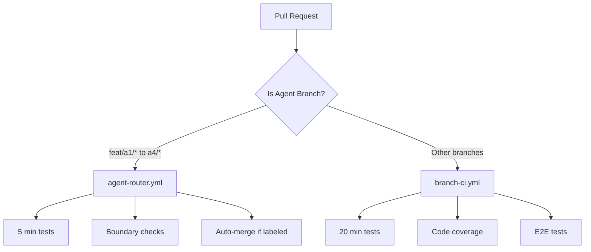

# 🚀 CI Optimization for 4-Agent Parallel Development

## The Solution: Minimal Changes, Maximum Savings

Instead of creating new workflows that duplicate logic, we've created a **smart router** that:
1. Detects agent branches (`feat/a1/*`, `feat/a2/*`, etc.)
2. Runs ONLY the agent's tests (5 minutes)
3. Skips the comprehensive workflow (saves 15-20 minutes)
4. Reuses existing workflows for non-agent branches

## What We Changed

### 1. New File: `.github/workflows/agent-router.yml`
- **Purpose**: Routes agent PRs to optimized path
- **Triggers**: Only on `feat/a[1-4]/*` branches
- **Time**: 5 minutes (vs 20 minutes)
- **Cost**: ~75% reduction in GitHub Actions minutes

### 2. Updated: `.github/workflows/branch-ci.yml`
- **Added**: Check to skip if agent branch
- **Result**: No duplicate runs
- **Backward Compatible**: Works exactly as before for non-agent branches

## How It Works



## GitHub Actions Minutes Saved

### Before (Everything runs branch-ci.yml)
```
Agent A1 PR: 20 minutes
Agent A2 PR: 20 minutes  
Agent A3 PR: 20 minutes
Agent A4 PR: 20 minutes
Total: 80 minutes per round
```

### After (Agent router optimization)
```
Agent A1 PR: 5 minutes (agent-router)
Agent A2 PR: 5 minutes (agent-router)
Agent A3 PR: 5 minutes (agent-router)
Agent A4 PR: 5 minutes (agent-router)
Total: 20 minutes per round

Savings: 75% reduction! (60 minutes saved)
```

## Configuration Required

### 1. Enable Auto-Merge in GitHub
```bash
gh repo edit --enable-auto-merge --enable-squash-merge
```

### 2. Create Auto-Merge Label
```bash
gh label create auto-merge --description "Auto-merge when CI passes" --color 0E8A16
```

### 3. Update Branch Protection (Optional)
- Keep existing rules
- No changes needed for agent branches to work

## Usage

### Agent Workflow
```bash
# In your worktree (e.g., wt-a1-mlops)
git checkout -b feat/a1/new-feature
# Make changes
git commit -m "feat: new feature"
git push origin feat/a1/new-feature

# Create PR with auto-merge
gh pr create --title "[A1] New feature" --label "auto-merge"

# CI runs in 5 minutes instead of 20!
```

### Non-Agent Workflow (Unchanged)
```bash
# Regular feature branch
git checkout -b feature/something
git push origin feature/something
gh pr create

# Uses existing branch-ci.yml (20 minutes)
```

## What Gets Tested

### Agent PRs (5 minutes)
- ✅ Only the agent's services
- ✅ Unit tests for those services
- ✅ Boundary checks (migrations, ports, etc.)
- ❌ Skip comprehensive tests
- ❌ Skip e2e tests
- ❌ Skip coverage reports

### Regular PRs (20 minutes)
- ✅ All services
- ✅ Full test suite
- ✅ E2E tests
- ✅ Coverage reports
- ✅ Multiple Python versions (for release branches)

## Monitoring Usage

### Check GitHub Actions Usage
```bash
# See which workflows are running
gh run list

# Check workflow usage stats
gh api /repos/$OWNER/$REPO/actions/workflows
```

### Track Savings
Each agent PR saves ~15 minutes. With 4 agents doing 2 PRs/day:
- Daily savings: 120 minutes
- Weekly savings: 600 minutes (10 hours!)
- Monthly savings: 2,400 minutes (40 hours!)

## Rollback Plan

If you need to disable the optimization:
1. Delete `.github/workflows/agent-router.yml`
2. Remove the `check-if-agent` job from `branch-ci.yml`
3. Everything returns to original behavior

## Summary

✅ **75% reduction in CI minutes for agent PRs**
✅ **Reuses existing, tested workflows**
✅ **No duplication of logic**
✅ **Backward compatible**
✅ **Easy to rollback if needed**

The optimization is transparent - agents just push their branches and get faster CI automatically!