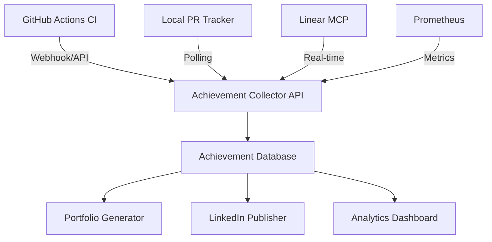

# Achievement Collector Integration & Enhancement Plan

## Current System Analysis

### Database Structure
The achievement collector has a well-designed database with:
- **Achievement** table: Core record with comprehensive fields for metrics, impact scores, social media publishing
- **GitCommit/GitHubPR** tables: Track source code changes
- **CIRun** table: CI/CD pipeline tracking
- **Relationships**: Proper foreign keys linking achievements to their sources

### Current Services
1. **GitHub PR Tracker**: Polls for merged PRs
2. **Linear Tracker**: Tracks completed issues/epics
3. **Prometheus Scraper**: Monitors KPI achievements
4. **Auto Tracker**: Coordinates all services

## Proposed Integration Strategy

### 1. Unified Tracking Architecture



### 2. Enhanced CI/CD Integration

Update the GitHub Actions workflow to:

```yaml
name: Enhanced Achievement Tracker

on:
  pull_request:
    types: [closed]
  workflow_run:
    workflows: ["*"]
    types: [completed]

jobs:
  track-achievement:
    steps:
      # Existing PR metrics collection...
      
      - name: Collect Enhanced Business Metrics
        run: |
          # Extract from PR description using AI
          python3 << 'EOF'
          from services.achievement_collector.services.ai_analyzer import AIAnalyzer
          
          analyzer = AIAnalyzer()
          
          # Analyze PR for business impact
          business_impact = analyzer.analyze_business_impact(pr_body)
          
          # Extract KPIs from code changes
          kpi_impact = analyzer.analyze_kpi_changes(changed_files)
          
          # Predict long-term value
          value_prediction = analyzer.predict_value_impact(pr_data)
          EOF

      - name: Sync with Prometheus Metrics
        run: |
          # Query Prometheus for before/after metrics
          curl -X POST ${{ secrets.PROMETHEUS_URL }}/api/v1/query_range \
            -d "query=posts_engagement_rate" \
            -d "start=$(date -d '7 days ago' +%s)" \
            -d "end=$(date +%s)"
```

### 3. Enhanced KPI Collection

#### A. Real-time Business Metrics

```python
class EnhancedMetricsCollector:
    """Collects comprehensive business and technical metrics."""
    
    async def collect_business_metrics(self, pr_data: Dict) -> Dict:
        """Extract business metrics from various sources."""
        
        metrics = {
            # Revenue Impact
            "revenue_impact": await self._analyze_revenue_impact(pr_data),
            "cost_savings": await self._calculate_cost_savings(pr_data),
            "efficiency_gains": await self._measure_efficiency_gains(pr_data),
            
            # User Impact
            "user_satisfaction": await self._predict_user_satisfaction(pr_data),
            "engagement_prediction": await self._predict_engagement_change(pr_data),
            "retention_impact": await self._analyze_retention_impact(pr_data),
            
            # Technical Excellence
            "performance_improvement": await self._measure_performance_gains(pr_data),
            "reliability_increase": await self._calculate_reliability_improvement(pr_data),
            "security_enhancement": await self._assess_security_improvements(pr_data),
            
            # Team Productivity
            "time_to_market": await self._calculate_time_to_market(pr_data),
            "developer_velocity": await self._measure_developer_velocity(pr_data),
            "collaboration_score": await self._calculate_collaboration_score(pr_data),
        }
        
        return metrics
```

#### B. Prometheus Integration Enhancements

```python
# Add these queries to prometheus_scraper.py
ENHANCED_QUERIES = {
    # Business KPIs
    "customer_acquisition_cost": 'sum(marketing_spend) / sum(new_customers)',
    "lifetime_value": 'avg(customer_revenue_total)',
    "churn_rate": 'rate(customer_churn[30d])',
    "viral_coefficient": 'sum(invites_sent) / sum(new_users)',
    
    # Technical KPIs
    "api_success_rate": 'sum(rate(http_requests_total{status!~"5.."}[5m])) / sum(rate(http_requests_total[5m]))',
    "p99_latency": 'histogram_quantile(0.99, http_request_duration_seconds_bucket)',
    "deployment_frequency": 'count(increase(deployments_total[7d]))',
    "mttr": 'avg(incident_resolution_time_seconds)',
    
    # Content Performance
    "content_virality_score": 'avg(posts_shares / posts_views)',
    "audience_growth_rate": 'rate(followers_total[7d])',
    "content_roi": '(revenue_from_content - content_creation_cost) / content_creation_cost',
}
```

### 4. Database Schema Enhancements

```sql
-- Add new columns to achievements table
ALTER TABLE achievements ADD COLUMN IF NOT EXISTS metadata JSONB DEFAULT '{}';

-- Metadata structure:
-- {
--   "ci_metrics": {...},
--   "business_kpis": {...},
--   "technical_metrics": {...},
--   "predictions": {...},
--   "correlations": {...}
-- }

-- Add new tracking table for KPI history
CREATE TABLE IF NOT EXISTS kpi_tracking (
    id SERIAL PRIMARY KEY,
    achievement_id INTEGER REFERENCES achievements(id),
    kpi_name VARCHAR(255) NOT NULL,
    baseline_value NUMERIC,
    achieved_value NUMERIC,
    improvement_percentage NUMERIC,
    measurement_date TIMESTAMP NOT NULL,
    data_source VARCHAR(100),
    confidence_score NUMERIC(3,2)
);

-- Add indexes for performance
CREATE INDEX idx_kpi_tracking_achievement ON kpi_tracking(achievement_id);
CREATE INDEX idx_kpi_tracking_date ON kpi_tracking(measurement_date);
```

### 5. Intelligent Achievement Scoring

```python
class IntelligentScorer:
    """Calculate achievement scores using multiple factors."""
    
    def calculate_comprehensive_score(self, achievement_data: Dict) -> Dict:
        """Calculate multi-dimensional achievement score."""
        
        # Base scores from existing logic
        technical_score = self._calculate_technical_complexity(achievement_data)
        business_score = self._calculate_business_impact(achievement_data)
        
        # New scoring dimensions
        innovation_score = self._calculate_innovation_score(achievement_data)
        collaboration_score = self._calculate_collaboration_score(achievement_data)
        learning_score = self._calculate_learning_score(achievement_data)
        
        # Weighted final score
        weights = {
            "technical": 0.25,
            "business": 0.35,
            "innovation": 0.15,
            "collaboration": 0.15,
            "learning": 0.10
        }
        
        final_score = sum(
            score * weights[dimension]
            for dimension, score in {
                "technical": technical_score,
                "business": business_score,
                "innovation": innovation_score,
                "collaboration": collaboration_score,
                "learning": learning_score
            }.items()
        )
        
        return {
            "overall_score": final_score,
            "dimensions": {
                "technical": technical_score,
                "business": business_score,
                "innovation": innovation_score,
                "collaboration": collaboration_score,
                "learning": learning_score
            },
            "percentile": self._calculate_percentile(final_score)
        }
```

### 6. Integration Points

#### A. Webhook Endpoints
```python
# Add to webhooks.py
@router.post("/metrics/prometheus")
async def prometheus_webhook(request: Request):
    """Receive alerts from Prometheus when KPIs are achieved."""
    
@router.post("/ci/github-actions")
async def github_actions_webhook(request: Request):
    """Receive detailed metrics from GitHub Actions."""
```

#### B. Scheduled Jobs
```python
# Add to celery tasks
@celery_app.task
def analyze_weekly_achievements():
    """Analyze achievements and identify patterns."""
    
@celery_app.task
def generate_achievement_insights():
    """Generate AI insights for achievement patterns."""
```

### 7. Recommended Implementation Steps

1. **Phase 1: CI/CD Integration** (Week 1)
   - Deploy GitHub Actions workflow
   - Set up webhook endpoints
   - Test with real PRs

2. **Phase 2: Enhanced Metrics** (Week 2)
   - Implement enhanced metrics collector
   - Update Prometheus queries
   - Add KPI tracking table

3. **Phase 3: Intelligent Scoring** (Week 3)
   - Implement multi-dimensional scoring
   - Add AI analysis for business impact
   - Create achievement insights dashboard

4. **Phase 4: Automation** (Week 4)
   - Set up scheduled analysis jobs
   - Implement pattern recognition
   - Create achievement recommendations

### 8. Configuration Management

```yaml
# achievement-collector-config.yaml
tracking:
  sources:
    - type: github_pr
      enabled: true
      mode: webhook  # webhook or polling
      
    - type: prometheus
      enabled: true
      metrics:
        - posts_engagement_rate
        - revenue_projection_monthly
        - custom_kpis
      
    - type: linear
      enabled: true
      mode: mcp  # mcp or api

scoring:
  weights:
    technical: 0.25
    business: 0.35
    innovation: 0.15
    collaboration: 0.15
    learning: 0.10
    
  thresholds:
    portfolio_ready: 70
    highlight: 85
    exceptional: 95

publishing:
  linkedin:
    auto_publish: true
    min_score: 75
    frequency: weekly
    
  portfolio:
    auto_update: true
    sections:
      - technical_achievements
      - business_impact
      - innovation
```

### 9. Monitoring & Alerting

```yaml
# Alerting rules for achievement tracking
groups:
  - name: achievement_tracking
    rules:
      - alert: HighValueAchievementCreated
        expr: achievement_impact_score > 90
        annotations:
          summary: "High-value achievement created: {{ $labels.title }}"
          
      - alert: KPITargetAchieved
        expr: kpi_achievement_rate > 0.9
        annotations:
          summary: "KPI target achieved: {{ $labels.kpi_name }}"
```

## Benefits of This Integration

1. **Comprehensive Tracking**: Captures achievements from all sources automatically
2. **Rich Context**: Combines technical metrics with business impact
3. **Intelligent Scoring**: Multi-dimensional evaluation of achievements
4. **Actionable Insights**: Pattern recognition and recommendations
5. **Portfolio Automation**: Auto-updates portfolio with high-value achievements
6. **Team Visibility**: Dashboards showing individual and team achievements

## Next Steps

1. Review and approve the integration plan
2. Set up GitHub Actions workflow in your repository
3. Configure webhook endpoints
4. Deploy enhanced metrics collection
5. Monitor and iterate based on results

This integration will transform your achievement tracking from a manual process to an intelligent, automated system that captures the full value of your work.