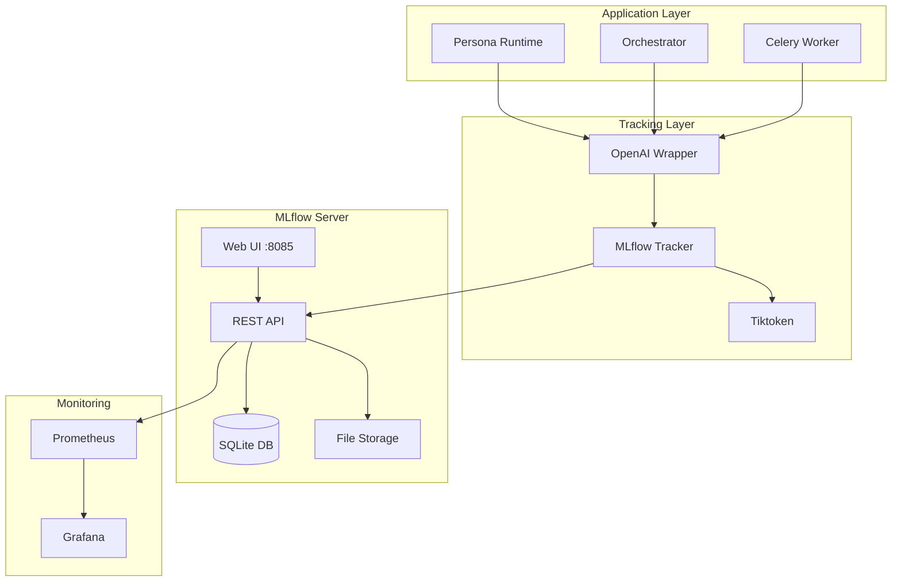

# MLflow Experiment Tracking Implementation (CRA-295)

## Overview

This document details the MLflow experiment tracking implementation for the Threads-Agent system. MLflow provides comprehensive tracking of all LLM API calls, enabling data-driven optimization of AI model usage, cost tracking, and performance monitoring.

## Table of Contents

1. [Architecture](#architecture)
2. [Components](#components)
3. [Integration Guide](#integration-guide)
4. [Deployment](#deployment)
5. [Usage Examples](#usage-examples)
6. [Monitoring & Observability](#monitoring--observability)
7. [Data Schema](#data-schema)
8. [Best Practices](#best-practices)
9. [Troubleshooting](#troubleshooting)

## Architecture

### System Architecture



### Data Flow

1. **LLM Call Initiated**: Service calls `chat_with_tracking()`
2. **Token Counting**: Tiktoken estimates token usage
3. **API Call**: OpenAI API is called and timed
4. **Tracking**: Results logged to MLflow with metadata
5. **Storage**: Data persisted to SQLite + filesystem
6. **Visualization**: Available in MLflow UI and Grafana

## Components

### 1. MLflow Tracking Module

**Location**: `services/common/mlflow_tracking.py`

**Key Features**:
- Experiment organization by persona and date
- Comprehensive metric tracking
- Error-resilient design
- Async decorator support

**Core Class**:
```python
class MLflowExperimentTracker:
    def track_llm_call(
        self,
        persona_id: str,
        model: str,
        prompt: str,
        response: str,
        prompt_tokens: int,
        completion_tokens: int,
        latency_ms: int
    ) -> None:
        """Track a single LLM API call to MLflow."""
```

### 2. OpenAI Integration Wrapper

**Location**: `services/common/mlflow_openai_wrapper.py`

**Purpose**: Seamless integration with existing OpenAI calls

**Main Function**:
```python
def chat_with_tracking(
    model: str,
    prompt: str,
    persona_id: str
) -> str:
    """Enhanced chat function with MLflow tracking."""
```

### 3. Configuration Module

**Location**: `services/common/mlflow_config.py`

**Environment Variables**:
- `MLFLOW_TRACKING_URI`: MLflow server URL (default: http://mlflow:5000)
- `MLFLOW_EXPERIMENT_NAME`: Default experiment name
- `AWS_ACCESS_KEY_ID`: S3/MinIO access (optional)
- `AWS_SECRET_ACCESS_KEY`: S3/MinIO secret (optional)

### 4. Kubernetes Deployment

**Location**: `services/mlflow/helm/`

**Key Resources**:
- Deployment with 2+ replicas
- Persistent Volume Claim (10Gi)
- Horizontal Pod Autoscaler
- Service (LoadBalancer)
- NetworkPolicy for security
- Prometheus ServiceMonitor

## Integration Guide

### Step 1: Update Service Dependencies

Add to your service's `requirements.txt`:
```txt
mlflow>=2.9.0
tiktoken>=0.5.1
```

### Step 2: Replace OpenAI Calls

**Before**:
```python
from services.common import openai_wrapper

response = openai_wrapper.chat(
    model="gpt-4o",
    prompt="Generate a viral post about AI"
)
```

**After**:
```python
from services.common.mlflow_openai_wrapper import chat_with_tracking

response = chat_with_tracking(
    model="gpt-4o",
    prompt="Generate a viral post about AI",
    persona_id="viral_content_creator"
)
```

### Step 3: Configure Environment

Set in your service's environment:
```yaml
env:
  - name: MLFLOW_TRACKING_URI
    value: "http://mlflow.mlflow.svc.cluster.local:5000"
```

## Deployment

### Prerequisites

1. Kubernetes cluster (k3d/k8s)
2. Helm 3.x installed
3. kubectl configured

### Deploy MLflow

```bash
# Create namespace
kubectl create namespace mlflow

# Deploy using Helm
cd services/mlflow
helm upgrade --install mlflow ./helm \
  --namespace mlflow \
  --values ./helm/values.yaml

# Wait for deployment
kubectl -n mlflow wait --for=condition=ready pod -l app.kubernetes.io/name=mlflow
```

### Access MLflow UI

```bash
# Port forward
kubectl port-forward -n mlflow svc/mlflow 8085:5000

# Open in browser
open http://localhost:8085
```

## Usage Examples

### Basic Tracking

```python
from services.common.mlflow_openai_wrapper import chat_with_tracking

# Simple usage
response = chat_with_tracking(
    model="gpt-4o",
    prompt="What is machine learning?",
    persona_id="educator_bot"
)
```

### Batch Processing

```python
# Track multiple calls
personas = ["viral_creator", "tech_expert", "comedian"]
prompts = [
    "Create a viral AI meme",
    "Explain quantum computing",
    "Tell a joke about robots"
]

results = []
for persona, prompt in zip(personas, prompts):
    response = chat_with_tracking(
        model="gpt-4o",
        prompt=prompt,
        persona_id=persona
    )
    results.append(response)
```

### Direct MLflow Usage

```python
from services.common.mlflow_tracking import MLflowExperimentTracker

tracker = MLflowExperimentTracker()
tracker.track_llm_call(
    persona_id="custom_bot",
    model="gpt-3.5-turbo",
    prompt="Custom prompt",
    response="Custom response",
    prompt_tokens=10,
    completion_tokens=20,
    latency_ms=150
)
```

## Monitoring & Observability

### MLflow UI Features

1. **Experiments View**:
   - Filter by persona: `tags.persona_id = "viral_content_creator"`
   - Sort by date: Experiments named `{persona}_{date}`

2. **Metrics Tracking**:
   - `prompt_tokens`: Input token count
   - `completion_tokens`: Output token count
   - `total_tokens`: Sum of prompt + completion
   - `latency_ms`: API call duration

3. **Run Comparison**:
   - Compare different models
   - Analyze token efficiency
   - Track cost trends

### Prometheus Metrics

Available at `http://mlflow:5000/metrics`:

```prometheus
# MLflow server metrics
mlflow_requests_total
mlflow_request_duration_seconds
mlflow_active_runs
mlflow_experiments_total
```

### Grafana Dashboard

Create visualizations for:
- Token usage by persona
- API latency trends
- Cost per persona (tokens × price)
- Model performance comparison

## Data Schema

### Experiment Naming

Format: `{persona_id}_{YYYY-MM-DD}`

Examples:
- `viral_content_creator_2025-01-31`
- `tech_educator_2025-01-31`

### Run Parameters

| Parameter | Type | Description |
|-----------|------|-------------|
| persona_id | string | Identifier for the AI persona |
| model | string | OpenAI model name |
| prompt | string | Input prompt text |
| response | string | Generated response text |

### Run Metrics

| Metric | Type | Description |
|--------|------|-------------|
| prompt_tokens | int | Estimated input tokens |
| completion_tokens | int | Estimated output tokens |
| total_tokens | int | Sum of all tokens |
| latency_ms | int | API call duration in ms |

## Best Practices

### 1. Persona ID Standards

Use consistent, descriptive persona IDs:
- ✅ `viral_content_creator`
- ✅ `technical_educator`
- ❌ `bot1`
- ❌ `test`

### 2. Error Handling

The tracker is designed to fail gracefully:
```python
# Tracking failures won't break your application
response = chat_with_tracking(...)  # Returns response even if MLflow fails
```

### 3. Token Optimization

Monitor token usage regularly:
```sql
-- SQLite query for MLflow database
SELECT 
    p.value as persona,
    AVG(m.value) as avg_tokens
FROM metrics m
JOIN params p ON m.run_uuid = p.run_uuid
WHERE m.key = 'total_tokens' 
  AND p.key = 'persona_id'
GROUP BY p.value;
```

### 4. Cost Tracking

Calculate costs using token metrics:
```python
# GPT-4o pricing (as of 2024)
input_price_per_1k = 0.005
output_price_per_1k = 0.015

cost = (prompt_tokens / 1000 * input_price_per_1k) + 
       (completion_tokens / 1000 * output_price_per_1k)
```

## Troubleshooting

### Common Issues

1. **MLflow Server Unreachable**
   ```bash
   # Check pod status
   kubectl -n mlflow get pods
   
   # Check logs
   kubectl -n mlflow logs -l app.kubernetes.io/name=mlflow
   ```

2. **Token Count Mismatch**
   - Tiktoken provides estimates, not exact counts
   - Different tokenizers for different models
   - Use OpenAI's response.usage for exact counts when available

3. **Storage Full**
   ```bash
   # Check PVC usage
   kubectl -n mlflow exec -it deployment/mlflow -- df -h
   
   # Increase PVC size in values.yaml
   persistence:
     size: 20Gi  # Increase as needed
   ```

4. **Performance Issues**
   - Enable HPA for auto-scaling
   - Increase worker/thread counts
   - Use PostgreSQL instead of SQLite for production

### Debug Mode

Enable detailed logging:
```python
import logging
logging.getLogger("services.common.mlflow_tracking").setLevel(logging.DEBUG)
```

## Future Enhancements

1. **Model Registry Integration** (CRA-296)
   - Version control for prompts
   - A/B testing support
   - Model performance tracking

2. **Advanced Analytics**
   - Persona performance dashboard
   - Cost optimization recommendations
   - Anomaly detection for token usage

3. **Integration Improvements**
   - Streaming response support
   - Batch API tracking
   - Function calling tracking

## Related Documentation

- [MLflow Official Docs](https://mlflow.org/docs/latest/index.html)
- [Kubernetes Deployment Guide](../services/mlflow/DEPLOYMENT_GUIDE.md)
- [E4.5 MLOps Epic Plan](https://linear.app/threads-agent/issue/CRA-295)

## Support

For issues or questions:
1. Check MLflow UI for tracking data
2. Review pod logs in Kubernetes
3. Consult this documentation
4. Create an issue in the repository