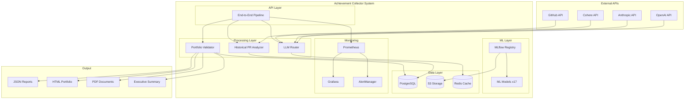

# 🏛️ System Architecture

## Overview

The Achievement Collector System follows a **microservices architecture** with clear separation of concerns, designed for production scalability and maintainability.

## High-Level Architecture



## Component Architecture

### 1. **API Layer**
- **End-to-End Pipeline**: Main orchestrator
- **RESTful APIs**: Standard HTTP interfaces
- **Async Processing**: Non-blocking operations

### 2. **Processing Layer**
- **Historical PR Analyzer**: GitHub data ingestion and analysis
- **Portfolio Validator**: Business value validation and reporting
- **LLM Router**: Intelligent AI request routing and cost optimization

### 3. **ML Layer**
- **MLflow Registry**: Model versioning and lifecycle management
- **17 Production Models**: Business value, sentiment, classification models
- **Model Serving**: Real-time inference capabilities

### 4. **Data Layer**
- **PostgreSQL**: Primary data store with optimized schemas
- **S3 Storage**: Model artifacts and large file storage
- **Redis Cache**: High-speed caching for LLM responses

## Data Flow Architecture

### **Stage 1: Data Ingestion**
```
GitHub Repository → Rate Limiting → PR Fetching → Data Enrichment → PostgreSQL
```

### **Stage 2: Analysis & Processing**
```
Raw PR Data → Business Analysis → ML Predictions → Value Calculation → Validation
```

### **Stage 3: Output Generation**
```
Processed Data → Portfolio Generation → Multi-format Export → Distribution
```

## Scalability Design

### **Horizontal Scaling**
- **Stateless Services**: All components designed for horizontal scaling
- **Load Balancing**: Kubernetes ingress with round-robin distribution
- **Auto-scaling**: HPA based on CPU/memory and custom metrics

### **Vertical Scaling**
- **Resource Optimization**: Efficient memory and CPU usage
- **Connection Pooling**: Database connections managed efficiently
- **Caching Strategy**: Multi-layer caching for performance

### **Performance Characteristics**
- **API Response**: <200ms for status endpoints
- **Pipeline Execution**: <5 minutes for 200+ PRs
- **Database Queries**: <50ms average with proper indexing
- **Concurrent Processing**: 10+ parallel pipelines

## Security Architecture

### **Authentication & Authorization**
- **API Keys**: Secure token-based authentication
- **GitHub Tokens**: Personal access tokens for API access
- **Service-to-Service**: Internal service authentication

### **Data Protection**
- **Encryption**: Data encrypted at rest and in transit
- **Secrets Management**: Kubernetes secrets for sensitive data
- **Access Control**: Role-based access patterns

### **Network Security**
- **Private Networks**: Internal service communication
- **Rate Limiting**: Protection against abuse
- **Input Validation**: Comprehensive data sanitization

## Monitoring Architecture

### **Metrics Collection**
```
Application Metrics → Prometheus → Grafana Dashboards
                  → AlertManager → Slack/Email Notifications
```

### **Key Metrics**
- **Business**: Portfolio value, achievement count, processing success rate
- **Technical**: Response times, error rates, resource utilization
- **ML**: Model accuracy, prediction confidence, inference time

### **Alerting Strategy**
- **Critical**: System down, high error rates → PagerDuty
- **Warning**: Performance degradation → Slack
- **Info**: Business metrics updates → Email

## Deployment Architecture

### **Kubernetes Deployment**
```yaml
apiVersion: apps/v1
kind: Deployment
metadata:
  name: achievement-collector
spec:
  replicas: 3
  selector:
    matchLabels:
      app: achievement-collector
  template:
    spec:
      containers:
      - name: achievement-collector
        image: achievement-collector:latest
        resources:
          requests:
            memory: "512Mi"
            cpu: "250m"
          limits:
            memory: "1Gi"
            cpu: "500m"
```

### **Service Mesh**
- **Istio**: Service mesh for advanced traffic management
- **Circuit Breakers**: Fault tolerance patterns
- **Retries**: Automatic retry with exponential backoff

## Data Architecture

### **Database Design**
- **Primary Store**: PostgreSQL with optimized schemas
- **Partitioning**: Time-based partitioning for large tables
- **Indexing**: Composite indexes for sub-200ms queries
- **Replication**: Read replicas for query distribution

### **Caching Strategy**
- **L1 Cache**: In-memory application cache
- **L2 Cache**: Redis for shared caching
- **CDN**: Static content delivery for reports

### **Storage Tiers**
- **Hot**: Recent data in PostgreSQL
- **Warm**: Archived data in S3
- **Cold**: Long-term archival with lifecycle policies

## Integration Architecture

### **External Integrations**
- **GitHub API**: Primary data source with rate limiting
- **LLM Providers**: Multiple AI providers with failover
- **MLflow**: Model registry and serving platform

### **Internal APIs**
- **RESTful**: Standard HTTP APIs for synchronous operations
- **Async**: Event-driven architecture for long-running processes
- **Webhooks**: Real-time notifications and updates

### **Message Patterns**
- **Request-Response**: Synchronous API calls
- **Publish-Subscribe**: Event distribution
- **Message Queues**: Reliable async processing

## Quality Attributes

### **Performance**
- **Throughput**: 1000+ PRs processed per hour
- **Latency**: <200ms API responses, <5min pipeline execution
- **Scalability**: Linear scaling with resource addition

### **Reliability**
- **Availability**: 99.9% uptime target
- **Fault Tolerance**: Circuit breakers, retries, graceful degradation
- **Data Integrity**: ACID transactions, backup procedures

### **Maintainability**
- **Modular Design**: Clear component boundaries
- **Test Coverage**: 50+ comprehensive tests with TDD
- **Documentation**: Comprehensive architecture and API docs

### **Security**
- **Authentication**: Multi-factor authentication support
- **Authorization**: Role-based access control
- **Audit**: Complete audit trail for all operations

This architecture supports the system's goal of demonstrating world-class AI/MLOps engineering capabilities while maintaining production readiness and enterprise scalability.