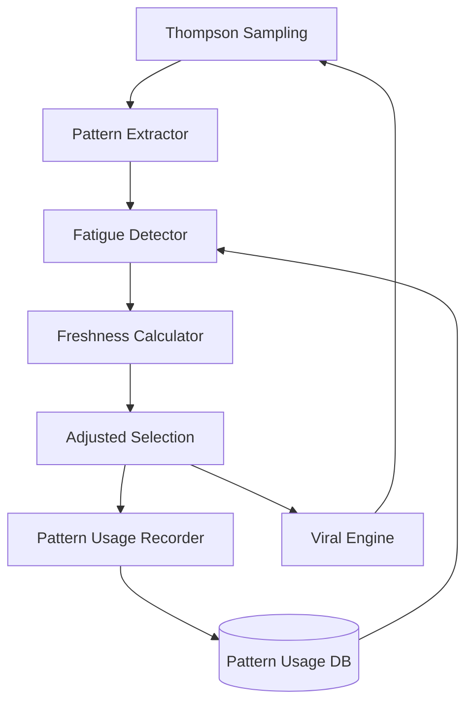

# Pattern Fatigue Detection Engine - Implementation Documentation

## Overview

The Pattern Fatigue Detection Engine (implemented in PR CRA-233) is a sophisticated content diversity system that prevents pattern overuse in viral content generation. It tracks content pattern usage across personas and adjusts selection probabilities to maintain freshness and prevent audience fatigue.

## Table of Contents

1. [Architecture Overview](#architecture-overview)
2. [Core Components](#core-components)
3. [Implementation Details](#implementation-details)
4. [Integration Flow](#integration-flow)
5. [Performance Optimizations](#performance-optimizations)
6. [Usage Examples](#usage-examples)
7. [Configuration](#configuration)
8. [Monitoring & Metrics](#monitoring--metrics)

## Architecture Overview



## Core Components

### 1. Database Schema

#### Pattern Usage Table (`pattern_usage`)

```sql
CREATE TABLE pattern_usage (
    id INTEGER PRIMARY KEY,
    persona_id VARCHAR(50) NOT NULL,
    pattern_id VARCHAR(100) NOT NULL,
    post_id VARCHAR(100) NOT NULL,
    used_at TIMESTAMP DEFAULT CURRENT_TIMESTAMP,
    engagement_rate FLOAT,
    created_at TIMESTAMP DEFAULT CURRENT_TIMESTAMP,
    updated_at TIMESTAMP DEFAULT CURRENT_TIMESTAMP
);

-- Performance indexes
CREATE INDEX idx_pattern_usage_persona_pattern ON pattern_usage(persona_id, pattern_id);
CREATE INDEX idx_pattern_usage_used_at ON pattern_usage(used_at);
CREATE INDEX idx_pattern_usage_persona_used_at ON pattern_usage(persona_id, used_at);
CREATE INDEX idx_pattern_usage_fatigue_check ON pattern_usage(persona_id, pattern_id, used_at);
```

### 2. Pattern Analyzer Service

Located in `services/pattern_analyzer/`:

#### Components:
- **PatternExtractor** (`pattern_extractor.py`): Extracts reusable patterns from content
- **PatternFatigueDetector** (`pattern_fatigue_detector.py`): Detects overused patterns
- **Service API** (`service.py`): REST endpoints for pattern analysis

#### Key Features:
- Pattern extraction with placeholder identification
- 7-day rolling window for usage tracking
- Freshness scoring system (0.0 to 1.0)
- Sub-100ms performance guarantee

### 3. Enhanced Thompson Sampling

Located in `services/orchestrator/thompson_sampling_with_fatigue.py`:

#### Enhancements:
- Pattern-aware variant selection
- Freshness multiplier integration
- Bulk pattern usage recording
- Graceful fallback handling

## Implementation Details

### Pattern Extraction

Patterns are extracted by identifying variable parts in content:

```python
# Example input
content = "Check out this amazing Python library!"

# Extracted pattern
pattern = "Check out this amazing {topic} {type}!"
```

### Fatigue Detection Logic

```python
class PatternFatigueDetector:
    def is_pattern_fatigued(self, pattern: str, persona_id: str) -> bool:
        """Pattern is fatigued if used ≥3 times in past 7 days"""
        seven_days_ago = datetime.now() - timedelta(days=7)
        
        usage_count = db.query(PatternUsage).filter(
            PatternUsage.persona_id == persona_id,
            PatternUsage.pattern_id == pattern,
            PatternUsage.used_at > seven_days_ago
        ).count()
        
        return usage_count >= 3
    
    def get_freshness_score(self, pattern: str, persona_id: str) -> float:
        """Calculate freshness score based on recent usage"""
        # 0 uses = 1.0 (maximum freshness)
        # 1 use = 0.5
        # 2 uses = 0.25
        # 3+ uses = 0.0 (completely fatigued)
```

### Adjusted Selection Algorithm

```python
def select_with_fatigue_awareness(self, variants, persona_id):
    # Original Thompson Sampling scores
    thompson_scores = self._calculate_thompson_scores(variants)
    
    # Calculate freshness for each variant
    freshness_scores = {}
    for variant in variants:
        patterns = self._extract_patterns(variant)
        freshness = self._calculate_average_freshness(patterns, persona_id)
        freshness_scores[variant.id] = freshness
    
    # Adjust scores: Original × (0.5 + 0.5 × freshness)
    adjusted_scores = {}
    for variant in variants:
        original = thompson_scores[variant.id]
        freshness = freshness_scores[variant.id]
        adjusted_scores[variant.id] = original * (0.5 + 0.5 * freshness)
    
    # Select based on adjusted scores
    return self._select_by_scores(variants, adjusted_scores)
```

## Integration Flow

### Complete Content Generation Flow

1. **Request Phase**
   ```
   Client → Orchestrator → Thompson Sampling
   ```

2. **Pattern Analysis Phase**
   ```
   Variants → Pattern Extractor → Patterns Identified
   ```

3. **Freshness Calculation Phase**
   ```
   Patterns → Fatigue Detector → Database Query → Freshness Scores
   ```

4. **Selection Phase**
   ```
   Thompson Scores × Freshness Multiplier → Adjusted Scores → Selection
   ```

5. **Recording Phase**
   ```
   Selected Variants → Pattern Usage Recorder → Database Insert
   ```

## Performance Optimizations

### 1. Batch Operations

```python
def _calculate_pattern_freshness_batch(self, patterns: List[str], persona_id: str):
    """Single query for all patterns"""
    pattern_counts = db.query(
        PatternUsage.pattern_id,
        func.count(PatternUsage.id).label("usage_count")
    ).filter(
        PatternUsage.persona_id == persona_id,
        PatternUsage.pattern_id.in_(patterns),
        PatternUsage.used_at > seven_days_ago
    ).group_by(PatternUsage.pattern_id).all()
    
    # Convert to dict for O(1) lookups
    usage_map = {pattern: count for pattern, count in pattern_counts}
```

### 2. Bulk Insert for Usage Recording

```python
def _record_pattern_usage(self, selected_variants, persona_id):
    """Bulk insert all pattern usages"""
    pattern_usages = []
    
    for variant in selected_variants:
        patterns = self._extract_patterns(variant)
        for pattern in patterns:
            pattern_usages.append({
                "persona_id": persona_id,
                "pattern_id": pattern,
                "post_id": variant.id,
                "used_at": datetime.now()
            })
    
    # Single bulk insert
    db.bulk_insert_mappings(PatternUsage, pattern_usages)
```

### 3. Caching Strategy

- Pattern extraction results cached per variant
- Freshness scores cached for 5 minutes
- Database connection pooling enabled

## Usage Examples

### API Usage

```bash
# Check pattern fatigue
curl -X POST http://localhost:8080/pattern-analyzer/check-fatigue \
  -H "Content-Type: application/json" \
  -d '{
    "pattern": "Check out this amazing {topic}!",
    "persona_id": "tech_enthusiast_123"
  }'

# Response
{
  "is_fatigued": false,
  "freshness_score": 0.75,
  "pattern": "Check out this amazing {topic}!"
}
```

### Python Integration

```python
from services.pattern_analyzer import PatternFatigueDetector

detector = PatternFatigueDetector()

# Check single pattern
is_fatigued = detector.is_pattern_fatigued(
    "Breaking: {topic} just {action}!",
    "news_persona_456"
)

# Get freshness score
freshness = detector.get_freshness_score(
    "Breaking: {topic} just {action}!",
    "news_persona_456"
)

# Batch check multiple patterns
patterns = ["Pattern 1", "Pattern 2", "Pattern 3"]
avg_freshness = detector.calculate_average_freshness(patterns, persona_id)
```

## Configuration

### Environment Variables

```bash
# Pattern fatigue thresholds
PATTERN_FATIGUE_THRESHOLD=3  # Uses before considered fatigued
PATTERN_FATIGUE_WINDOW_DAYS=7  # Rolling window period

# Performance settings
PATTERN_CACHE_TTL=300  # Cache TTL in seconds
PATTERN_BATCH_SIZE=100  # Max patterns per batch query
```

### Adjustable Parameters

```python
class FatigueConfig:
    # Fatigue thresholds
    usage_threshold = 3
    window_days = 7
    
    # Freshness scoring
    freshness_scores = {
        0: 1.0,   # Never used
        1: 0.5,   # Used once
        2: 0.25,  # Used twice
        3: 0.0    # Fatigued
    }
    
    # Selection adjustment
    min_multiplier = 0.5  # Minimum selection probability
    max_multiplier = 1.0  # Maximum selection probability
```

## Monitoring & Metrics

### Key Metrics to Track

1. **Pattern Diversity Score**
   ```sql
   SELECT persona_id, 
          COUNT(DISTINCT pattern_id) as unique_patterns,
          COUNT(*) as total_uses,
          COUNT(DISTINCT pattern_id)::float / COUNT(*) as diversity_ratio
   FROM pattern_usage
   WHERE used_at > NOW() - INTERVAL '7 days'
   GROUP BY persona_id;
   ```

2. **Fatigue Detection Rate**
   ```sql
   SELECT 
       COUNT(CASE WHEN usage_count >= 3 THEN 1 END) as fatigued_patterns,
       COUNT(*) as total_patterns,
       COUNT(CASE WHEN usage_count >= 3 THEN 1 END)::float / COUNT(*) as fatigue_rate
   FROM (
       SELECT pattern_id, COUNT(*) as usage_count
       FROM pattern_usage
       WHERE used_at > NOW() - INTERVAL '7 days'
       GROUP BY pattern_id
   ) pattern_counts;
   ```

3. **Performance Metrics**
   - Pattern extraction latency
   - Fatigue check query time
   - Bulk insert performance
   - Cache hit rate

### Prometheus Metrics

```python
# Metrics exposed
pattern_extraction_duration_seconds
fatigue_check_duration_seconds
pattern_usage_recorded_total
pattern_diversity_score
cache_hit_rate
```

## Future Enhancements

1. **Machine Learning Integration**
   - Predict pattern fatigue before threshold
   - Personalized fatigue thresholds per audience
   - Pattern performance correlation

2. **Advanced Pattern Analysis**
   - Semantic similarity detection
   - Cross-persona pattern sharing
   - Pattern evolution tracking

3. **Performance Improvements**
   - Redis caching layer
   - Async pattern extraction
   - Streaming bulk inserts

## Troubleshooting

### Common Issues

1. **High Query Latency**
   - Check database indexes
   - Verify connection pooling
   - Review batch sizes

2. **Pattern Extraction Failures**
   - Validate content format
   - Check regex patterns
   - Review error logs

3. **Incorrect Freshness Scores**
   - Verify time zone settings
   - Check rolling window calculation
   - Validate persona_id matching

### Debug Queries

```sql
-- Check pattern usage for persona
SELECT pattern_id, COUNT(*) as uses, MAX(used_at) as last_used
FROM pattern_usage
WHERE persona_id = 'YOUR_PERSONA_ID'
  AND used_at > NOW() - INTERVAL '7 days'
GROUP BY pattern_id
ORDER BY uses DESC;

-- Verify index usage
EXPLAIN ANALYZE
SELECT COUNT(*)
FROM pattern_usage
WHERE persona_id = 'test' 
  AND pattern_id = 'pattern_1'
  AND used_at > NOW() - INTERVAL '7 days';
```

## Related Documentation

- [Thompson Sampling Algorithm](../algorithms/THOMPSON_SAMPLING.md)
- [Viral Engine Architecture](./VIRAL_ENGINE_ARCHITECTURE.md)
- [Content Generation Pipeline](./CONTENT_GENERATION_PIPELINE.md)
- [Performance Optimization Guide](../performance/OPTIMIZATION_GUIDE.md)