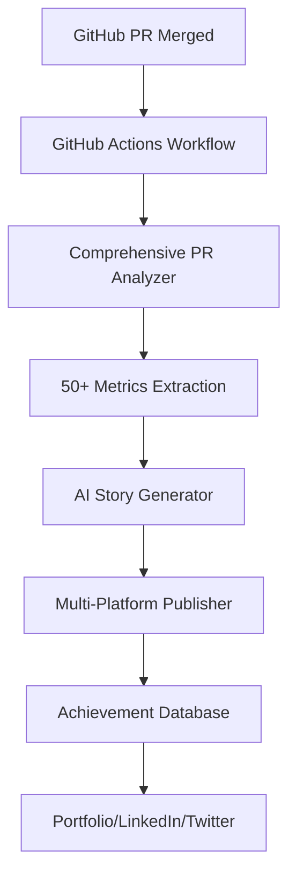

# 🚀 PR-Based Achievement Collection System

## Overview

The PR-Based Achievement Collection System automatically captures, analyzes, and transforms your GitHub Pull Requests into compelling professional achievements. It extracts 50+ metrics, generates AI-powered stories for different audiences (HR, tech interviewers, CEOs), and prepares content for multiple platforms.

## Table of Contents
- [Architecture](#architecture)
- [Core Components](#core-components)
- [Installation & Setup](#installation--setup)
- [Usage Guide](#usage-guide)
- [Best Practices](#best-practices)
- [API Reference](#api-reference)
- [Configuration](#configuration)
- [Troubleshooting](#troubleshooting)

## Architecture



### System Flow

1. **PR Merge Detection**: GitHub Actions workflow triggers on PR merge
2. **Comprehensive Analysis**: Extracts code, performance, business, team metrics
3. **Story Generation**: AI creates persona-specific narratives
4. **Storage**: Achievements stored with full metadata in SQLite/PostgreSQL
5. **Publishing**: Content prepared for LinkedIn, Twitter, Dev.to, Portfolio

## Core Components

### 1. GitHub PR Tracker (`github_pr_tracker.py`)
- Monitors merged PRs using GitHub CLI (`gh`)
- Extracts PR metadata, labels, reviewers
- Calculates merge time and collaboration metrics

### 2. Comprehensive PR Analyzer (`comprehensive_pr_analyzer.py`)
Extracts 50+ metrics across 13 categories:

#### Code Metrics
- Languages used and distribution
- Files changed, lines added/deleted
- Code complexity changes
- Refactoring patterns
- Change categories (feature, bugfix, etc.)

#### Performance Metrics
- Latency improvements
- Throughput changes
- Resource utilization
- Database query optimization
- Caching effectiveness

#### Business Metrics
- Financial impact (cost savings, revenue)
- User impact (affected users, satisfaction)
- Operational efficiency gains
- Time-to-market improvements

#### Quality Metrics
- Test coverage changes
- Code quality scores
- Security vulnerability fixes
- Documentation improvements

#### Team Metrics
- Collaboration (reviewers, comments)
- Review time and iterations
- Cross-team participation
- Mentorship activities

#### Composite Scores (0-100)
- Overall Impact
- Technical Excellence
- Business Value
- Team Collaboration
- Innovation Index

### 3. AI Story Generator (`story_generator.py`)
Generates tailored narratives for different personas:

#### Technical Story
- Deep technical challenges solved
- Architecture decisions
- Performance optimizations
- Code quality improvements

#### Business Story
- ROI and cost savings
- User experience improvements
- Market competitiveness
- Strategic alignment

#### Leadership Story
- Team collaboration
- Mentorship moments
- Strategic thinking
- Project management

#### Hiring Personas
- **HR Manager**: Soft skills, collaboration, problem-solving
- **Tech Interviewer**: Technical depth, best practices, innovation
- **Startup CEO**: Speed, business impact, resourcefulness
- **Investor**: Scalability, market fit, execution

### 4. Database Models

#### Achievement Model
```python
class Achievement:
    id: int
    title: str
    description: str
    category: str  # feature, optimization, bugfix, etc.
    started_at: datetime
    completed_at: datetime
    duration_hours: float
    impact_score: float  # 0-100
    complexity_score: float  # 0-100
    business_value: str
    source_type: str  # "github_pr"
    source_id: str  # "PR-123"
    tags: List[str]
    skills_demonstrated: List[str]
    ai_summary: str
    portfolio_ready: bool
    metadata_json: dict  # Full analysis data
```

#### PRAchievement Model
```python
class PRAchievement:
    pr_number: int
    title: str
    merge_timestamp: datetime
    code_analysis: dict
    impact_analysis: dict
    stories: dict
    ci_metrics: dict
    performance_metrics: dict
```

## Installation & Setup

### Prerequisites
- Python 3.8+
- GitHub CLI (`gh`) installed and authenticated
- OpenAI API key (optional, for production)
- SQLite or PostgreSQL

### Installation Steps

1. **Clone the repository**
```bash
git clone <repository-url>
cd services/achievement_collector
```

2. **Create virtual environment**
```bash
python -m venv venv
source venv/bin/activate  # On Windows: venv\Scripts\activate
```

3. **Install dependencies**
```bash
pip install -r requirements.txt
```

4. **Configure environment variables**
```bash
# .env file
OPENAI_API_KEY=your-api-key-here  # Use "test" for mock mode
USE_SQLITE=true  # Or configure DATABASE_URL for PostgreSQL
GITHUB_TOKEN=your-github-token
```

5. **Initialize database**
```bash
python -c "from db.models import Base; from db.config import engine; Base.metadata.create_all(bind=engine)"
```

### GitHub Actions Setup

1. **Add workflow file** (`.github/workflows/achievement-collector.yml`):
```yaml
name: Collect PR Achievement
on:
  pull_request:
    types: [closed]

jobs:
  collect-achievement:
    if: github.event.pull_request.merged == true
    runs-on: ubuntu-latest
    steps:
      - uses: actions/checkout@v3
      - uses: actions/setup-python@v4
        with:
          python-version: '3.10'
      
      - name: Analyze and Store Achievement
        env:
          OPENAI_API_KEY: ${{ secrets.OPENAI_API_KEY }}
          DATABASE_URL: ${{ secrets.DATABASE_URL }}
        run: |
          pip install -r requirements.txt
          python scripts/collect_pr_achievement.py \
            --pr-number ${{ github.event.pull_request.number }}
```

2. **Add secrets to repository**:
   - `OPENAI_API_KEY`: Your OpenAI API key
   - `DATABASE_URL`: PostgreSQL connection string

## Usage Guide

### Manual Achievement Collection

```python
import asyncio
from services.comprehensive_pr_analyzer import ComprehensivePRAnalyzer
from services.story_generator import StoryGenerator
from services.db_operations import create_achievement_from_pr
from db.config import get_db

async def collect_pr_achievement(pr_number: int):
    # Get PR data
    pr_data = get_pr_data(pr_number)  # Using gh CLI
    
    # Analyze PR
    analyzer = ComprehensivePRAnalyzer()
    analysis = await analyzer.analyze_pr(pr_data, base_sha, head_sha)
    
    # Generate stories
    generator = StoryGenerator()
    stories = await generator.generate_persona_stories(analysis)
    
    # Store achievement
    db = next(get_db())
    achievement = create_achievement_from_pr(db, pr_data, analysis)
    
    print(f"Achievement {achievement.id} created for PR #{pr_number}")
```

### Retrieving Achievements

```python
from services.db_operations import get_recent_achievements, get_achievement_by_pr

# Get recent achievements
achievements = get_recent_achievements(db, limit=10, portfolio_ready_only=True)

# Get specific PR achievement
achievement = get_achievement_by_pr(db, pr_number=123)
```

### Exporting for Portfolio

```python
from export.portfolio_generator import PortfolioGenerator

generator = PortfolioGenerator()
portfolio_content = generator.generate_portfolio(achievements)
```

## Best Practices

### 1. PR Title and Description
**DO:**
- Use clear, descriptive titles: "Optimize API response time by implementing Redis caching"
- Include metrics in description: "Reduces latency by 40%, affects 10k daily users"
- Add context about business impact

**DON'T:**
- Vague titles: "Fix bug" or "Update code"
- Skip PR descriptions
- Forget to link related issues

### 2. Labels and Metadata
**Recommended Labels:**
- `performance`: For optimization PRs
- `feature`: For new functionality
- `bugfix`: For bug fixes
- `security`: For security improvements
- `refactoring`: For code improvements
- `breaking-change`: For API changes

### 3. Commit Messages
**Format:**
```
feat(module): brief description

- Detailed change 1
- Detailed change 2

Metrics:
- Performance: 40% faster
- Users affected: 10,000
- Cost savings: $5,000/month
```

### 4. Review Process
- **Request diverse reviewers**: Get frontend, backend, and product perspectives
- **Document decisions**: Explain architectural choices in PR comments
- **Include benchmarks**: Add performance test results

### 5. Evidence Collection
**Include in PR:**
- Before/after performance graphs
- Architecture diagrams
- Test coverage reports
- User impact analysis

### 6. AI Story Generation Tips
**To maximize story quality:**
- Quantify impact with numbers
- Explain technical challenges overcome
- Highlight collaboration moments
- Document learning experiences

## API Reference

### REST Endpoints

#### Create Achievement from PR
```http
POST /api/achievements/pr/{pr_number}
Content-Type: application/json

{
  "pr_data": {...},
  "analysis": {...}
}
```

#### Get Achievement
```http
GET /api/achievements/{achievement_id}
```

#### List Achievements
```http
GET /api/achievements?page=1&per_page=20&category=feature&min_impact_score=70
```

#### Get PR Achievement Details
```http
GET /api/achievements/pr/{pr_number}/details
```

### Python SDK

```python
from achievement_collector import AchievementClient

client = AchievementClient(api_key="your-key")

# Collect PR achievement
achievement = await client.collect_pr(pr_number=123)

# Search achievements
results = await client.search(
    category="feature",
    min_impact_score=70,
    skills=["Python", "Redis"]
)
```

## Configuration

### Environment Variables

| Variable | Description | Default |
|----------|-------------|---------|
| `OPENAI_API_KEY` | OpenAI API key for story generation | Required |
| `DATABASE_URL` | PostgreSQL connection string | - |
| `USE_SQLITE` | Use SQLite instead of PostgreSQL | false |
| `GITHUB_TOKEN` | GitHub API token | Required |
| `MOCK_MODE` | Use mock responses for testing | false |
| `WEBHOOK_SECRET` | Secret for webhook validation | - |

### Configuration File (`config.yaml`)

```yaml
analyzer:
  performance_threshold: 10  # Minimum % improvement to track
  complexity_weights:
    cyclomatic: 0.3
    cognitive: 0.4
    halstead: 0.3

story_generator:
  model: "gpt-4"
  temperature: 0.7
  max_tokens: 1000
  
  personas:
    - technical
    - business
    - leadership
    - hr_manager
    - tech_interviewer
    - startup_ceo

scoring:
  impact_weights:
    performance: 0.25
    business: 0.30
    quality: 0.20
    innovation: 0.25
```

## Troubleshooting

### Common Issues

#### 1. "NOT NULL constraint failed: achievements.duration_hours"
**Solution**: Ensure PR has both `created_at` and `merged_at` timestamps

#### 2. "NoneType object has no attribute"
**Solution**: Update to latest version with null-safety fixes

#### 3. "OpenAI API key not configured"
**Solution**: Set `OPENAI_API_KEY` environment variable

#### 4. GitHub API rate limits
**Solution**: 
- Use authenticated requests with `GITHUB_TOKEN`
- Implement caching for PR data
- Use webhook events instead of polling

### Debug Mode

Enable debug logging:
```python
import logging
logging.basicConfig(level=logging.DEBUG)
```

### Health Check

```bash
curl http://localhost:8000/health
```

Expected response:
```json
{
  "status": "healthy",
  "database": "connected",
  "github": "authenticated",
  "openai": "configured"
}
```

## Performance Optimization

### 1. Caching Strategy
- Cache PR analysis results for 24 hours
- Store generated stories for reuse
- Cache GitHub API responses

### 2. Async Processing
- Use background tasks for analysis
- Process multiple PRs concurrently
- Stream responses for large datasets

### 3. Database Optimization
- Index on `source_id`, `pr_number`
- Partition by `completed_at` for large datasets
- Use connection pooling

## Security Considerations

1. **API Keys**: Store in environment variables or secrets manager
2. **Webhooks**: Validate signatures for GitHub webhooks
3. **Database**: Use parameterized queries, never raw SQL
4. **User Data**: Anonymize sensitive information in achievements
5. **Access Control**: Implement proper authentication for API endpoints

## Future Enhancements

1. **Real-time Dashboard**: Live achievement tracking
2. **Team Analytics**: Department-wide achievement insights
3. **ML-Powered Insights**: Predict achievement impact
4. **Integration Extensions**: JIRA, GitLab, Bitbucket
5. **Mobile App**: On-the-go achievement tracking

---

## Support

For issues, questions, or contributions:
- GitHub Issues: [Link to issues]
- Documentation: [Link to docs]
- Email: support@example.com

## License

[Your License Here]